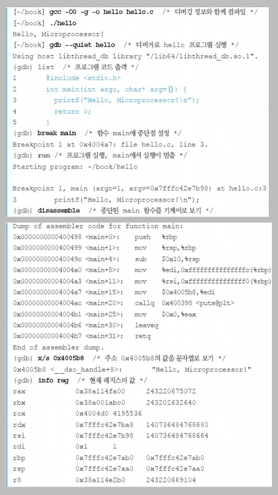
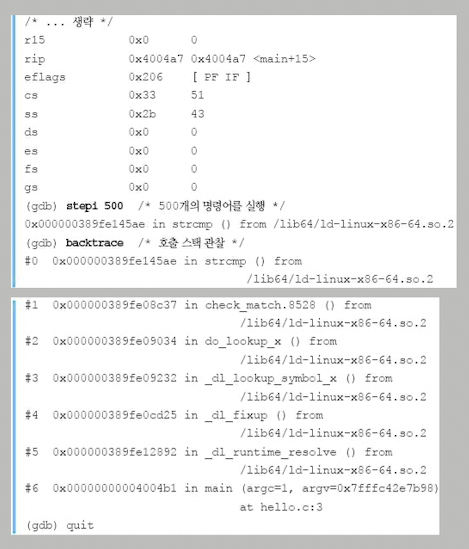
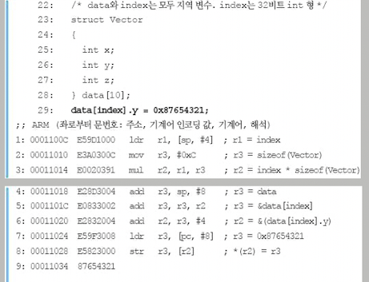
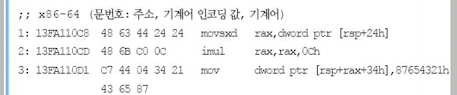

# 0 들어가기 앞서

현대 processor의 기본 기술인 pipeline은 대표적인 parallel programming 방법론이다. processor는 instruction 사이의 dependency(의존성)을 분석해 instruction 분석율을 높일 수 있다.

> dependency 분석은 parallel programming만이 아니라 compiler나 software testing에서도 기본적인 개념이다.

현대로 오면서 processor에서 생각해야 할 부분이 많이 늘어났다. 아래에서 몇 가지를 소개한다.

- multicore processor에서는 cache 관리가 더 어려워진다.(서버 시스템에서도 고스란히 볼 수 있는 문제다.) 

- 현대 processor에서는 **branch predictor**(분기 예측기)라는 component가 필수적으로 들어가 있다.(이 branch predictor 역시 cache처럼 software적인 아이디어로 만들어져 있다.)

- 현대 processor의 주요 기능으로 prefetching도 꼽을 수 있다.(OS에서도 쉽게 찾아볼 수 있다.)

- processor를 알면 각종 보안 취약성의 원인을 이해할 수 있다.

- graphics processing unit인 GPU는 보조 processor처럼 사용했지만, 단순한 구조지만 백여 개가 넘는 작은 core가 뭉친 특성으로 특정 연산에서 processor보다 훨씬 빠른 처리를 보인다.

---

# 1 Instruction Set Architecture(ISA)

## 1.1 architectural state

프로그래머들은 알게 모르게 processor와 직접 대화하고 있었다. 아래는 "Hello, Microprocessor!" C program 코드다.

```C
#include <stdio.h>

int main(int argc, char*, argv[]) {
    printf("Hello, Microprocessor!\n");
    return 0;
}
```

이 C program을 64bit 리눅스에서 디버거 gdb로 잡아본 화면이다.

참고로 사용한 gdb 명령은 다음과 같다.

- info reg: register의 state

- backtrace: 어떤 경로로 function이 invoke됐는지 invoke stack으로 확인

- x/s: "Hellom Microprocessor!" 문자열이 담긴 memory address 확인

- stepi : 한 명령씩 수행





위 debug 화면이 processor와 소통하는 모습을 나타낸 것으로 볼 수 있다. 이렇게 외부 화면으로 보이는 '현재 processor의 state'를 computer **architectural state**(구조적 상태)라고 부른다.

> 엄밀히 말하면 architectural state는 현재 processor가 <U>수행 중인 process의 state를 지닌 각종 register들의 값</U>을 의미한다.

dual core, quad core processor 등은 이 architectural state를 core 개수만큼을 동시에 갖는다.

> 정확히는 core 개수만큼이 아니라, hardware thread(혹은 logic processor)마다 architectural state를 갖는다.

---

## 1.1 Instruction Set Architecture

만약 특정 programming language를 다른 programming language로 옮기는 program인 compiler가 없다면, 프로그래머는 processor가 이해하는 **machine language**(기계어) 혹은 **assembly language**(어셈블리어)를 이용해야 할 것이다.

이때 이 machine language를 **ISA**(Instruction Set Architecture, 명령어 집합) 구조라 부른다. 아래는 instruction 중 세 가지 예시다.

- 기본적인 사칙 연산과 논리 연산

- memory에 store(저장)하고 load(적재)하기

- program 실행 흐름을 제어하는 분기 및 호출 명령(if/goto, call/return)

- 시스템 내부 제어나 상태를 관찰

> intel과 ARM processor는 x86이라는 그들만의 언어를 사용한다. 따라서 내부 구조가 사뭇 달라도 언어가 같아서 문제 없이 program이 작동한다. 하지만 ISA가 다른 processor라면 x86 ISA로 만들어진 program은 작동하지 않는다.

> JVM(자바 가상머신)이나 .NET framework 등이 이런 문제를 해결해주려고 등장했다.

하나의 instruction에는 이 instruction의 종류와 operand 등 여러 내용이 기술되어 있다. natural language "A += 7"을 x86 언어로 표현하면 다음과 같다.

> 4byte integer variable A에 constant 7을 더해 다시 A에 쓰라"

> add dword ptr [A], 0x07

- dword ptr: 4byte integer로 해석하라(x86은 <U>d</U>ouble <U>word</U>가 4byte이다. ptr은 pointer를 의미한다.)

  - 다시 말해 ptrA가 A의 address(&A)를 담고 있다고 하면, "*ptrA = *ptrA + 7"로 이해한다.

> encoding: 0x83 0x45 0xF8 0x07

이 연산에 **atomicity**를 보존하라는 동작을 추가로 지시할 수 있다. atomicity를 보존한다는 말은 multi thread 실행에서 안전할 수 있도록 LOCK 접두어를 추가해 준다는 의미다.

> LOCK add dword ptr [A], 0x07

> 0xF0 0x83 0x45 0xF8 0x07

이 외에 실제로 program이 돌아가려면 ISA 위에 ABI(Application Binary Interface)라는 application과 os 사이의 약속도 필요하다. 

> calling conventions(함수호출규약)이나 바이너리 포맷에 대한 규약이 대표적이다.

---

### 1.2 CISC, RISC

1. CISC

processor, 정확히 말해 general purpose microprocessor가 처음 탄생한 1970년대에는 compiler의 도움이 크지 못했다. 그래서 processor 설계자는 programming language와 1:1 대응이 될 정도로 풍분한 여러 instruction을 제공하려고 노력했다.

> 예를 들어 x87 산술 coprocessor의 instruction은 sin과 exp 같은 초월 함수까지 담고 있었다.

게다가 이 당시에는 memory의 비용이 비쌌기 때문에, 조금이라도 instruction의 크기를 줄여야 했다. 따라서 짧은 길이의 instruction에 많은 뜻을 함축하도록 설계했다. 이때의 ISA가 바로 복잡한 형태의 CISC(Complex Instruction Set Computer)이다.

> 널리 쓰이는 x86 ISA로 대표적인 것이 IA-32가 있다. 1986년 출시된 인텔 80386의 ISA의 정확한 명칭이 IA-32(Intel Architecture 32 bit)이다. IA-32는 16bit 코드도 실행할 수 있는 하위 호환성을 가졌다.

> 그리고 AMD가 제안한 x86의 64bit 확장(AMD64, x86-64)도 이제는 사실상 표준이다.(인텔에서는 Intel64라고 부른다.)

CISC의 주요 특징은 instruction의 길이가 주로 가변적이며, 여러 복잡한 형태의 address mode를 지원한다는 점이다. 또한 GPR(General Purpose Register. 범용 레지스터)의 개수가 비교적 적다.

2. RISC

compiler가 CISC ISA가 지원하는 모든 instruction과 addressing mode를 사용하지 않고, 일부만 사용한다는 점에서 착안했다.(CISC가 너무 과도하게 설계한 부분도 있었다.)

예를 들어 program 코드에는 constant가 종종 등장하는데, 사칙 연산의 operand나 분기문의 destination 등이 주로 immediate(constant)로 쓰인다. CISC는 보통 가변 길이므로 16bit 또는 32bit immediate operand를 쉽게 instruction에 포함시켰다.

그러나 실제로는 98%의 program이 13bit면 충분히 constant를 표현할 수 있었고(보통 -1이나 10 같은 작은 정수를 사용하므로), 분기문도 대부분은 destination을 relative address로 표현했으므로 그 범위가 크지 않았다.

> Computer Architecture 설계의 첫 번째 원칙이 "Make Common Case Fast", 자주 있는 경우를 빠르게 하라라는 점을 떠올리자.

그래서 processor 구조의 단순함과 고속화를 위해 instruction 길이를 4byte 정도로 제한했다. instruction 크기를 고정하고 그 개수를 대폭 줄인 RISC가 등장한 것이다.

> 사실 지금에 이르러서는 간단한 instruction의 경우 회로가 단순해져서 더 저렴한 비용으로 제조할 수 있다. 대신 compiler가 더 일을 하게 된다.

아이폰 같은 스마트폰에 많이 쓰이는 ARM과, IBM의 PowerPC가 대표적인 RISC ISA이다. 학교에서 자주 배우는 MIPS(Microprocessor without Interlocked Pipeline Stages) 역시 유명한 RISC 형식 언어이다.

---

### 1.3 대표적인 RISC인 MIPS의 구조

대표적인 RISC에 해당하는 MIPS 구조를 살펴보자. 모든 instruction의 길이가 32bit로 고정되어 있으며, 매우 규칙적인 format를 가지고 있다.

모든 instruction은 R(Register), I(Immediate), J(Jump) 타입 중 하나로 표현된다. 이때 <U>Immediate는 의미적으로 constant에 해당</U>된다.

| 종류 | 31~26 | 25~21 | 20~16 | 15~11 | 10~6 | 5~0 |
| :---: | :---: | :---: | :---: | :---: | :---: | :---: |
| R | Opcode | source | target | destination | shift | function | 
| I | Opcode | source | target || 16bit constant(immediate) || 
| J | Opcode ||| 26bit 분기 destination |||

- opcode: instruction의 종류를 기술하며, 항상 최상위 6bit에 존재한다.

> 반면 x86은 opcode의 위치와 길이조차 가변이라서 분석 작업이 훨씬 복잡하다.

- "A = B + C"와 같은 명령은 그대로 R 타입에 대응된다.

- 각 source(operand)로는 register 타입만 올 수 있고, resister는 총 32개가 MIPS ISA에 정의되어 있어서 5bit씩 할당된다.

하지만 이런 RISC의 단순함 때문에 생기는 단점도 있다. RISC는 instruction 폭이 고정이므로 (CISC가 간단히 처리하는 것도) 여러 단계에 걸쳐 해결해야 한다.

만약 0x7FFFFFFF처럼 4byte의 폭이 필요한 아주 큰 constant를 읽는 명령이 있다면, 4byte 크기의 instruction을 사용하는 RISC에서 한번에 읽을 수 있을까? 당연히 opcode나 destination 등을 기술할 공간이 없으므로 불가능하다.

이 경우 상위 16bit를 **lui**(Load Upper 16-bit Immediate) instruction으로 먼저 register에 올린 뒤, **ori**(OR with 16-bit immediate) 명령으로 나머지 하위 16bit를 따로 읽어 서로 OR 연산을 하는 것으로 대체한다.

아니면 이 constant 자체를 program 어딘가에 쓰고, 이 address의 내용을 읽는 것으로 구현할 수도 있다.

> 이에 반해 CISC는 instruction 길이가 가변이므로, 이 constant를 바로 instruction 안에 넣을 수 있어 한번에 처리할 수 있다.

---

### 1.4 CISC와 RISC의 설계 차이

CISC는 memory가 귀한 옛날에 탄생한 모델이어서 최대한 작은 공간에 많은 뜻을 함축해야 했다. x86의 경우 1byte로도 instruction을 표현할 수 있는가 하면, 최대 17byte까지 길어질 수 있다.

- stack memory 공간 조작에서의 차이

대표적으로 x86은 stack memory 공간을 직접 조작하는 push/pop 같은 instruction이 지원된다. program은 function invoke를 관리하기 위한 정보(**activation frame**)나 local variable을 stack에 넣어서 쓰고 읽으며 계산한다.

하지만 RISC는 이런 함축적인 instruction이 보통 없고 명시적으로 처리해야 한다. 직접 stack 꼭대기를 가리키는 **sp**(스택 포인터)를 바꾸고, 그 자리에 data를 이동하는 명령을 지시해야 한다.

- addressing mode에서의 차이

CISC는 operand로 memory address가 바로 올 수 있지만, RISC는 register만 올 수 있다.(RISC는 source에 직접 memory address가 올 수 없고, 반드시 register를 거쳐가야 한다.) RISC는 다음과 같이 연산한다.

> "4byte integer variable A에 constant 7을 더해 다시 A에 쓰라"

1. load r1, dword ptr[A]

2. add r1, r1, 0x07

3. store dword ptr[A], r1

source에 직접 memory address가 올 수 없고 register만 올 수 있기 때문에 addressing mode가 상당히 단순하다. 

> 이 부분에서 주의할 점은 CISC로도 얼마든지 RISC 형식으로 코드를 만들 수 있으며, 반대로도 가능하다.

> 또한 CISC instruction 역시 바로 memory address가 온다고 하더라도 processor가 직접 memory address을 대상으로 연산을 시행하지는 않는다.

- array 접근 방식의 차이

addressing mode는 매우 빈번히 등장하는 array 접근 방식도 정의한다. array variable에 접근하려면 반드시 '**base point**(기저 주소) + **offset**(얼마나 떨어져 있는지를 나타내는 오프셋)'이 필요하다.

> 예를 들어 integer array A의 10번째 element에 접근(A[10])한다면, 이는 array A의 base point에 offset인 10*sizeof(int)를 더한 값에 접근한다는 뜻이다.

RISC는 'base point + offset'처럼 비교적 단순한 memory 형태만 지원한다. 반면 CISC인 x86에서는 'base point + offset + index*scale'과 같은 복잡한 형태를 지원한다. 따라서 x86 compiler는 더 짧은 instruction 생성이 가능하다.

> 이런 식으로 CISC는 복잡함을 하드웨어가 도맡아 처리한다. 복잡한 수학 function이나 memory address를 바로 source로 받는 등이 가능해서 그렇다. 하지만 RISC는 이를 compiler가 처리한다.

> compiler가 똑똑히 번역해 주는 덕분에 더욱 ISA를 다양하게 제공할 필요가 없게 됐으며, 절약한 transistor 수를 성능 향상 부분에 쓸 수 있게 되었다. 대표적으로 RISC의 GPR은 CISC보다 많다.(x86은 8개, x86-64는 16개를 지원하지만, RISC는 32개 이상을 지원한다.)

---

### 1.4.1 코드로 보는 CISC와 RISC 차이

C/C++ program 코드를 CISC(x86-64)와 RISC(ARM)로 compile해서 비교할 것이다. 

```C
/* data와 index는 모두 local variable. index는 32bit int type */
struct Vector
{
  int x;
  int y;
  int z;
} data[10];
data[index].y = 0x87654321;
```

위는 program 코드다. 이 program은 간단한 structure type을 정의하고, 이 structure type 중 하나의 element에 접근한다.

> structure type이란 하나 이상의 variable을 묶어서 새로운 data type을 정의하는 도구다. c언어에서 struct 명령을 사용한다.

<br/>

### <span style='background-color: #C2B2B2; color: #F7F7F7'>&nbsp;&nbsp;&nbsp;🔍 풀이: RISC 형식(ARM)의 compile&nbsp;&nbsp;&nbsp;</span>

우선 RISC 형식의 ARM 코드부터 보자.



- r1, r2, r3는 register를 뜻한다.

- ldr: memory에 있는 값을 register에 load하는 명령

- str: 연산 결과를 다시 memory에 store

- mov: data 복사를 담당하는 명령(이동)

  - register $\rightarrow$ register

  - memory $\leftrightarrow$ register

  - Immediate $\rightarrow$ register or memory

- mul(곱셈), add(덧셈)

<br/>

계산 순서는 다음과 같다.

<br/>

1. ldr r1, [sp, #4]: r1에 variable index의 값이 load된다. 정확히는 index의 address를 얻고 그 address에 저장된 값을 읽는 pointer 연산이다.

   - sp는 stack point이다.

   - machine code에서 <U>[]는 그 부분을 address로 해석하라는 뜻</U>이다.

   - variable index는 local variable이므로 sp를 기점으로 어딘가 저장되어 있는데, 예제에서는 4byte 떨어진 지점이라 r1 = *(sp + 4); 같은 형태가 되었다.

<br/>

2. mov r3, #0xC: sizeof(Vector)를 r3에 옮긴다.

   - Vector structure의 크기는 compile할 때 이미 결정되므로 바로 constant 12(0x0C)가 지정되었다.

<br/>

3. mul r2, r1, r3: 이제 r3와 r1을 곱해 index*sizeof(Vector)를 얻고 그 결과를 r2에 저장한다.(offset)

<br/>

4. add r3, sp, #8: array의 base point를 알아내서 그 address를 r3에 저장한다.

   - 이 예제에서 array는 sp에서 8byte 떨어진 곳에 위치해 있다.(compile가 관리해 준다.) 따라서 sp에 8을 더한 값이 base point가 된다.

<br/>

5. add r3, r3, r2: base point + offset 계산으로 data[index]의 address를 알아낸다.  r3에 저장된다.

<br/>

6. add r2, r3, #4: local variable y를 구해서 r2에 저장한다. data[index] address에 4를 더해서 구한다.

   - y는 이 structure의 두 번째 member variable로, base point에서 4만큼 떨어져 있다.(compiler의 alignment 방법에 따라 달라질 수 있다.)
  
<br/>

7. ldr r3, [pc, #8]: 저장할 data, 0x87654321을 memory에서 읽어온다.

   - constant는 4byte 폭이므로 RISC에서 바로 instruction에 넣을 수 없다. 대신 data를 PC(Program Counter)를 기점으로 있다.

   - 현재 program의 위치 0x00011024에서 8만큼 떨어진 지점에 0x87654321이 저장된 셈이다.(<U>constant 자체를 program 어딘가에 쓰고, 이 address를 읽은 셈</U>이다.)

   > PC가 base point로 이동했을 때 굳이 8만큼 떨어진 이유는, ARM ISA에서 (암묵적으로) 이 값을 정했기 때문이며 이 값이 하드웨어 구현에 더 용이하다.

<br/>

8. str3 r3, [r2]: 마지막으로 constant 값을 원하는 곳, 즉 data[index].y의 address에 저장한다.

<br/>

RISC는 단계가 많지만 매우 직관적인 절차로 진행되었다. 이 코드를 수행하기 위해 필요한 공간은 instruction 8개(32byte)와 4byte 데이터 공간(0x87654321)로, 총 36byte가 소요된다.

### <span style='background-color: #C2B2B2; color: #F7F7F7'>&nbsp;&nbsp;&nbsp;🔍 풀이: CISC 형식(x86-64)의 compile&nbsp;&nbsp;&nbsp;</span>



- rax: register로 접두어 r은 64bit register라는 점을 나타낸다.

   - 동일하게 32bit인 register는 eax이다.

- movsxd: variable index가 32bit이므로 register에 맞춰서 64bit type으로 적절히 바꿔주기 위해서 mov의 변종인 movsxd를 쓴다.

   - 또한 index가 signed이므로 이 점을 유지하면서 확장한다. 이 기능을 **sign extension**(부호확장)이라고 한다.

   - x86은 load/store/move를 통상 mov 하나로 포괄한다.

- imul: integer 곱(mul)을 뜻한다.

<br/>

1. movsxd rax,dword ptr [rsp+24h]: vatiable index의 address에서 값을 읽어 register rax에 저장한다.

   - 여기서 variable index는 rsp(stack pointer)에서 24byte 만큼 떨어진 곳에 있다.

<br/>

2. imul rax,rax,0Ch: 마찬가지로 index*sizeof(Vector)를 계산해서 이 결과 값을 rax에 저장한다.(offset)

   - RISC와 마찬가지로 compile가 sizeof(Vector)를 알고 있다.

<br/>

3. mov dword ptr [rsp+rax+34h],87654321h: 'rsp+rax+34h'라는 address에 0x87654321을 저장한다.

   - rsp+34h는 base point에 member variable y의 offset 4가 더해진 값이다. 
   
   - 다시 말해 base + offset + constant 같은 복잡한 계산을 한번에 수행한다.

> 참고로 x86은 Little endian(리틀 엔디안)이므로, 4byte 0x87654321이 instruction 속에서 21, 34, 65, 87 순으로 적힌다.

---