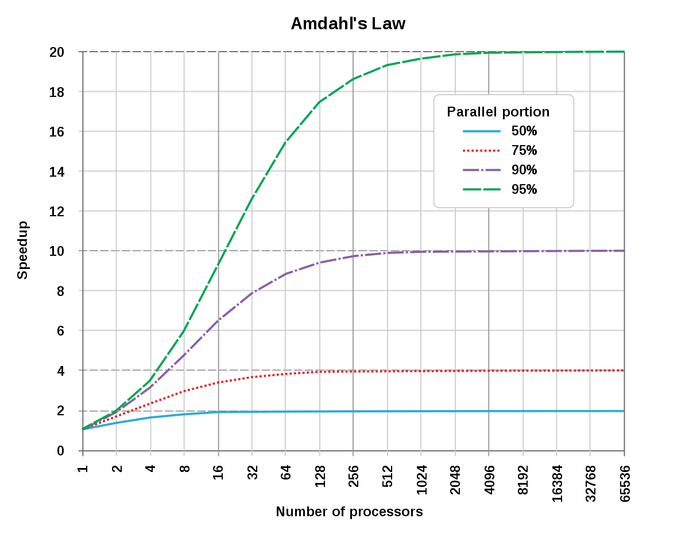

# 4 암달의 법칙과 processor의 성능 지표

간단한 산수 문제를 하나 풀어보자.

- program에서 function foo()가 전체 program 수행 시간 중 80%를 차지한다는 사실을 성능 profiling 도구로 알아냈다.

- 그렇다면 foo() function을 optimization해서 function의 수행 시간을 절반으로 줄인다면, 전체 program 수행 시간은 얼마로 계산될까?

- 물론 다른 부분에서 overhead를 유발하지 않는다는 가정을 한다.

> **profiling**(프로파일링. 성능 분석)은 program의 시간 및 공간 복잡도, 특정 instruction 이용, function call의 주기와 빈도 등을 측정하는 dynamic program analysis(동적 프로그램 분석. 실제 혹은 가상 processor에서 program을 실행하면서 수행)의 한 형태이다.

> function 이름으로 foo가 자주 등장하는 이유는 역사적인 배경 때문이다. foo fighter에서 쓰인 foo와 같으며, 이는 forward observation officer(전방 감시 사무관, 정찰병)을 의미한다. 마찬가지로 bar라는 명칭 역시 foo fighter를 줄여서 부르던 FUBAR에서 유래했다.

정답은 간단한 산수를 수행하면 알 수 있다. 원래 수행 시간을 1이라고 하면, 개선된 program은 0.6만큼의 시간이 든다. 즉, 1/0.6 = 1.67배 정도 성능이 향상되는 셈이다.

여기서 생각해 볼 점은 한 function의 속도가 2배가 됐다고 해서, program 전체의 성능 향상이 2배가 되는 것은 아니라는 점이다.

만약 foo() function의 수행 시간을 1/10까지 줄일 수 있다면, 전체 수행 시간은 (원래를 1이라 할 때) 0.28이 될 것이다. 따라서 1/0.28 = 3.56배가 향상된 셈이다. 이처럼 foo() function의 수행 시간 향상이 있어도, 전체 수행 시간 향상에는 어느 정도 한계가 있는 셈이다.

다시 말해 아무리 optimization을 해도, 이 optimization의 영향을 받지 않는 다른 부분 때문에 효과는 제한적일 수밖에 없다. 이것이 바로 **Amdahl's law**(암달의 법칙)이다.

$$ {{1} \over {(1-P)+{{P} \over {S}}}} $$

- P: optimization된 부분의 비율

- S: optimization된 부분의 **speedup**(성능 향상)

이 공식은 전체 중 P 부분만큼이 S만큼 개선될 때 기대되는 전체 **speedup**(성능 향상)을 나타낸다. 앞서 풀어본 예제를 위 식에 대입하면 다음과 같다.

- 80%를 차지하는 foo() function의 수행 시간을 절반으로 줄인 경우(다시 말해 2배 speedup)

$$ {{1} \over {(1-0.8)} + {{0.8} \over {2}}} = 1.67 $$

- 80%를 차지하는 foo() function의 수행 시간을 1/10으로 줄인 경우(다시 말해 10배 speedup)

$$ {{1} \over {(1-0.8) + {{0.8} \over {10}}}} = 3.56 $$

> 분모가 전체 시간 시간을 1로 뒀을 때, 개선된 시간을 의미한다. 앞서 수행한 간단한 산수와 다를 바 없다.

Amdahl's law는 <U>'헛된 곳에 시간을 낭비하지 말고, 가장 많은 시간이 소요되는 곳에 집중해야 한다'</U>는 사실을 시사한다. processor 설게자 역시 자신이 optimization하려는 부분이 전체에서 얼마나 중요한지 잘 생각하고 우선순위를 결정해야 한다.

---

## 4.1 parallel processing에서의 Amdahl's law

Amdahl's law는 parallel processing에서도 고스란히 적용할 수 있다. 다음 문제를 보자

- program을 profiling하자 80%의 부분을 parallelize할 수 있음을 밝혀냈다.

- 그렇다면 processor가 2개, 4개, 8개, 16개일 때 성능은 각각 어떻게 변할까?

전체 program 수행 시간을 1로 생각하면, 0.8에 해당하는 부분을 processor N개로 parallel processing하는 것이다. N개로 완벽히 parallel processing할 수 있다면 0.8/N으로 줄어들 것이다.

하지만 나머지 0.2는 여전히 직렬로 수행되어야 하므로, 총 수행 시간은 0.2 + 0.8/N이 될 것이다. 이대로 계산했을 때 processor 개수 2,4,8,16의 수행시간은 각각 0.6, 0.4, 0.3, 0.25로 개선된다.

> 극단적으로 양자 컴퓨터의 힘을 빌어 무한히 parallelize한다더라도 program의 수행 시간은 0.2가 극한값이 될 것이다.

결국 parallelize가 가능한 부분이 80%라면 최대로 얻을 수 있는 성능 향상은 5배가 한계이다. Amdahl's law를 parallel processing 버전으로 다시 표현하면 아래와 같은 식이 된다.

$$ {1 \over {(1-P)+ {{P} \over {N}}}} $$

- P: parallelize 가능한 부분의 비율

- N: processor의 개수

> 물론 processor N개가 완벽하게 P만큼의 일을 parallel processing한다는 매우 이상적인 가정 하에 표현한 식이다.



- program 중 50%만 parallelize가 가능하다면, 아무리 많은 processor가 있더라도 2배가 넘는 speedup(성능 향상)은 일어날 수 없다.

- program 중 90%가 parallelize가 가능하고 아무리 많은 processor가 있어도, 10개가 넘는 speedup은 일어날 수 없다.

위는 Amdahl's law의 parallel processing에 따른 speedup을 나타낸 그래프이다. 이런 결론이 주는 시사점은 바로 'parallelize가 가능한 부분을 효율적으로 처리'하는 것도 중요하지만, '**무엇보다도 parallize가 가능한 부분을 극대화**'하는 것이 중요하다.

다시 말해 직렬로 처리해야 하는 부분(1-P)를 줄이는 것이 핵심이다. 다행히 과학이나 수학 관련 program은 대체로 수행 시간의 대부분을 iteration이 차지하며 parallelize한 경우가 많다. 따라서 수행 시간의 대부분을 parallel processing으로 효율성을 높일 수 있다.

하지만 그렇지 않은 program 역시 많다. compiler나 OS의 주요 code는 연산이 직렬로 수행되는 경우가 많다.

> 사실 위에서 소개한 Amdahl's law는 너무 많은 부분을 간단하게 가정했다. 실제로 어떤 program을 parallelize 가능한 부분과 그렇지 않은 부분을 나누는 작업은 간단하지 않다.(보통 이 두 부분이 혼재되어 있기 때문이다.)

> 또한 실제 parallelize 후 얻는 성능은 이보다 크게 낮을 가능성이 있다. thread 생성 비용과 같은 고정 비용이나, process/thread 사이의 **mutex**(뮤텍스. process 또는 thread 등의 processing unit이 같이 접근해서는 안 되는 공유 영역) 같은 동기화 객체로 효율이 떨어지게 된다.

> 참고로 주어진 작업이 별 노력 없이 완벽히 parallelize 가능할 때, 이 작업을 **embarrassingly parallel**하다고 부른다.

---

## 4.2 program의 수행 시간

computer의 속도를 정의하는 방법은 다음과 같다.

1. **latency**: 레이턴시. program을 얼마나 빠르게 완료하는가.

2. **throughput**: 처리율. 단위 시간당 얼마나 program을 많이 처리할 수 있는가.

더 미시적으로 살펴보면, processor가 주어진 program 기계어를 얼마나 빠르게, 또 얼마나 많이 처리할 수 있는가를 따지는 것과 같다.

> 대표적으로 **cache**는 latency를 개선하고, **pipeline**은 throughput를 높인다.

- instruction 완료 latency

latency는 **response time**(응답 시간) 또는 **execution time**(실행 시간)으로도 불린다. processor가 어떤 program을 처리하는 데 걸리는 execution time은 다음과 같다.

$$ T = N \times T_{inst} $$

- $T$ : program 전체 execution time

- $N$ : 주어진 program이 실행한 instruction 개수

- $T_{inst}$ : instruction 하나를 처리하는 데 드는 평균 시간이다.[s/N]

> 물론 현대 OS는 여러 program과 background service가 함께 작동하므로 이런 공식이 잘 들어맞지는 않는다. 하지만 N이 충분히 크다면, 이런 noise를 무시할 수 있다.

그렇다면 계산을 하기 위해 필요한 $N$ 과 $T_{inst}$ 는 어떻게 알아낼 수 있을까? 

우선 $N$ 은 단순히 program의 static(정적인) 크기가 아니고, 실제 dynamic하게 실행될 때의 instruction 개수를 의미한다. 따라서 program이 실제 input 값으로 실행될 때 처리되는 instruction들의 trace를 뽑아내야 한다.

> 이런 작업은 보통 **instrumentation** 기법으로 쉽게 구현할 수 있다.

그 다음 instruction 하나를 처리하는 데 필요한 평균 시간인 $T_{inst}$ 를 알기 위해서는 여러 정보를 모아야 한다. instruction은 그 종류에 따라 수행 시간이 제각각이기 때문이다.(예를 들어 memory나 floating point 연산보다는 integer 사칙 연산이 더 빠르다.)

1. program이 어떤 종류의 instruction을 얼마나 많이 가지고 있는가

2. 각각의 instruction 종류가 이 processor에서 수행될 때 소요되는 평균 시간은 얼마인가

1번은 $N$ 과 마찬가지로 trace 과정에서 쉽게 알 수 있다. 2번은 processor 제작 회사의 공개 정보나 실험을 통해 알 수 있다. 

> $T_{inst}$ 는 processor의 clock 속도에 따라 다르기 때문에, 보통 단위를 cycle로 나타내는 것이 편하다.

clock 속도를 고려해서 latency를 구하는 식을 고쳐 쓰면 다음과 같다.

$$ T = N \times CPI \times T_{cycle} $$

- **CPI**(Cycles Per Instruction) : instruction당 평균 소요 cycle. [cycle/개]

여기서 instruction 종류마다 처리 cycle이 다른 점을 고려해서, 일종의 가중 평균을 도입하면 다음과 같이 식이 바뀐다.

$$ T = (\sum{N_{i} \times CPI_{i}}) \times T_{cycle} $$

---


### <span style='background-color: #393E46; color: #F7F7F7'>&nbsp;&nbsp;&nbsp;📝 예제: latency 구하기&nbsp;&nbsp;&nbsp;</span>

2GHz로 작동하는 processor C에서 program A를 실행하면서 총 10억 개의 instruction이 수행되었다.

이때 수행된 instruction의 종류와, 그 instruction에 해당하는 'processor C의 평균 CPI'는 다음과 같다.

| instruction 종류 | program A에서 차지하는 비율 | processor C의 평균 CPI |
| :---: | :---: | :---: |
| ALU 연산 | 50% | 1 |
| memory load | 20% | 2 |
| memory store | 10% | 3 |
| branch(분기문) | 20% | 4 |

전체 latency $T$ 의 값은?

### <span style='background-color: #C2B2B2; color: #F7F7F7'>&nbsp;&nbsp;&nbsp;🔍 풀이&nbsp;&nbsp;&nbsp;</span>

latency를 구하는 수식은 다음과 같았다.

$$ T = (\sum{N_{i} \times CPI_{i}}) \times T_{cycle} $$

따라서 순서대로 계산을 하면 아래와 같다.

$$ T = [(1/2 \times 1 )+(1/5 \times 2)+(1/10 \times 3)+(1/5 \times 4)] \times 1억 \times (1/2,000,000,000s/cycle) = 1s $$

---

만약 ISA가 같은 두 processor의 성능을 비교한다면, $N$ 항은 같을 것이다. clock까지 같다면 결국 비교할 항은 $CPI$ 만 남는다.

> 그런데 보통 CPI보다는 CPI의 역수이자, 한 cycle당 완료 가능한 instruction 개수를 뜻하는 **IPC**(Instruction Per Cycle)를 더 많이 쓴다.

> 이런 성질 때문에 IPC가 processor의 성능을 가늠하는 데 주로 쓰인다.

> 하지만 이 말은 즉, 다른 ISA에서 측정하면 IPC의 결과는 달라질 수 있다는 말이다.

이외에도 1초당 수행된 instruction의 개수(Intruction Per Second)를 백만(Million) 단위로 표현한 MIPS 성능 단위도 있다. 또한 floating point 처리만 고려한 FLOPS(Floating Point Per Second) 단위도 존재한다.

> 특히 GPU 성능을 표현할 때는 Giga 단위인 GFLOPS나 Tera 단위인 TFLOPS도 많이 사용한다.

> 다만 MIPS는 이상적인 instruction flow에서의 peak 값을 사용하므로 오해를 하면 안 된다.

---

## 4.3 성능 향상을 위해 해야 할 일

따라서 latency를 줄이기 위해서는 수식의 세 가지 항을 줄일 필요가 있다.

---

### 4.3.1 instruction 개수 N을 줄이기

우선 이 부분은 compiler가 큰 역할을 한다. 여러 optimization으로 불필요한 연산을 제거하거나 대체한다.

> 대표적인 optimization으로 Common Sub-expression Elimination(중복 수식 제거), Constant Propagation(상수 전파), Dead Store Elimination(죽은 쓰기 제거) 등이 있다. 고급 optimization 중 대표적으로는 PRE(Partial Redundancy Elimination 부분 중복 제거)도 있다.

다음 예제를 보자.

```c
void foo() {
    int sum = 0;
    for (int i = 0; i < 1000000; ++i) {
        sum += i;
    }
}
```

위 예제는 백만 번 loop를 수행하며 variable sum에 계산을 하지만, 이 'sum' variable은 function foo의 local variable이므로 일반적인 방법으로는 그 어느 곳에서도 reference될 수 없다.

다시 말해, sum variable에 행해지는 모든 연산은 compiler가 제거하고, foo function을 텅텅 비게 만들어 버린다.

그러나 program 크기를 줄이는 방법이 항상 성능을 향상시키지는 않는다. 간혹 program 크기가 조금 늘어나는 쪽이 성능이 늘어나는 경우가 있다. 이런 대표적인 optimization으로 **inlining**(인라인화)와 **loop unrolling**(루프 풀기)를 들 수 있다.

- inlining: function의 크기가 작거나 여러 특정 조건에 해당하면, function call 대신 function 자체를 그대로 복사해서 붙여 넣어 버린다.

  - 이런 optimization을 실행하면 code 크기 자체는 커지지만, function call로 드는 비용은 아낄 수 있어서 결과적으로 성능이 향상된다.

- loop unrolling: code 크기는 늘어나지만, branch(분기문)의 횟수를 줄이는 방식으로 pipeline의 효율성을 높이거나 loop 탈출 비교 횟수 자체를 줄인다.

그러나 이런 optimization은 **tradeoff** 성격을 가지므로, 얼마나 많은 function에 적용을 할 것인지를 결정하는 어려운 문제가 생긴다.

> 소개한 방법 외에도 processor 내부에서도 Macro-op Fusion, Micro-op Fusion 기법 등 N을 줄이는 여러 기법을 사용한다.

---

### 4.3.2 CPI 줄이기

이전까지는 RISC와 CISC를 고려하지 않았다. 우선 RISC 시점으로 살펴 보자.

ISA의 일부만 사용하는 RISC는 특성상 가장 기본적인 연산만 제공하므로, 일반적으로 변역되는 instruction의 양이 더 많다. 따라서 N은 더 커질 수밖에 없다.

하지만 instruction 자체는 비교적 간단하므로 CISC보다 CPI 값은 낮아진다.

반면 CISC는 N 값이 작은 대신, CPI가 큰 형태가 된다.

> 하지만 실제 내부에서는 instruction이 decoder를 통해 세부 uOP(마이크로옵)으로 쪼개지므로, 정확히는 uOP의 개수와 CPI를 고려해야 한다.

결국 CPI는 무엇보다도 컴퓨터 내부 구조, 즉 microarchitecture(마이크로아키텍처)에 가장 큰 영향을 받는다. cache를 개선하거나 기타 여러 장치를 개선하면 CPI를 직접 개선할 수 있는 것이다. 

> 이런 개선에 해당하는 pipeline, superscalar, out-of-order execution(비순차 실행), branch prediction(분기 예측), speculative execution(분기적 실행) 등은 사실상 모두 CPI를 줄이는 것, 즉 다시 말해 IPC를 높이는 방법이다.

---

### 4.3.3 Clock 속도를 빠르게 만들기

우선 clock 속도는 semiconductor 제조 기술에 달렸다. 미세 공정으로 물리적으로 전자가 이동해야 하는 거리를 줄인다면 clock이 더 높아질 수 있다.

> 여러 미세 공정으로 더 많은 transistor를 집적함으로써 cache 용량도 늘릴 수 있다.

microarchitecture 수준에서도 clock을 높일 수 있다. clock을 결정짓는 주된 요소가 바로 한 cycle에 완료되어야 하는 일의 양이므로, 일의 양 자체를 줄이면 clock 속도가 높아지는 셈이다.

---