# 7 명령어 파이프라인

## 7.1 pipeline의 기본 개념

> [재미로 읽어보는 '병렬 처리'](https://medium.com/naver-cloud-platform/%EC%9E%AC%EB%AF%B8%EB%A1%9C-%EC%9D%BD%EC%96%B4%EB%B3%B4%EB%8A%94-%EB%B3%91%EB%A0%AC%EC%B2%98%EB%A6%AC-c60c8e3b62a7)

microprocessor의 성능이 비약적으로 높아지는 데 기여한 가장 핵심적인 기술로 pipeline(파이프라인)을 뽑을 수 있다. 곱셈 같은 시간이 오래 걸리는 ALU와 어느 정도 시간이 걸리는 주요 작업은 대부분 pipelining되어 있다.

pipeline은 연속으로 주어지는 어떤 작업을 처리하는 데 있어 **throughput**(처리율)을 높이는 일반적인 알고리즘을 가리킨다. 이 알고리즘의 핵심은 '재사용'과 '병렬 실행'에 있다. 다음은 간단히 보는 pipeline 개념이다.

1. pipelining할 작업을 여러 세부 단계로 나눈다.

2. 처리할 첫 번째 data는 pipeline의 첫 번째 단계로 들어가서 그 작업을 완료한다.

3. 이 data가 두 번째 단계로 넘어가면서, 첫 번째 단계는 비게 된다.

4. 다음 data를 첫 번째 단계에서 처리하면, 동시에 두 data를 처리할 수 있게 된다.

이런 방법으로 throughput, 단위 시간당 처리할 수 있는 일의 양을 크게 높일 수 있다. 이제 예시를 통해 pipeline의 효율성을 파악해 보자. 

- A 기숙사는 세탁과 건조가 합쳐진 일체형 세탁기 하나가 있다. 세탁에 30분, 건조에 30분이 걸린다

- B 기숙사는 세탁에 30분 걸리는 세탁기 하나와, 건조에 30분 걸리는 건조기 하나가 따로 있다.

이때 기숙사마다 두 학생이 각각 빨래와 세탁과 건조를 이용해야 한다면, 걸리는 시간은 다음과 같다.

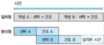

이를 일반화하면 다음과 같다.

- 일체형: 학생 $N$ 명이 이용하려면 $N$ 시간이 걸린다.

- 분리형: 학생 $N$ 명이 이용하려면 ${(N+1) \over {2}}$ 시간이 걸린다.

   - ${3 \over 2}, {5 \over 2}, {7 \over 2} \cdots {(N+1) \over 2}$ : 재귀적으로 얻을 수 있다.

N이 무한대로 커지면 결국 이 둘은 2배의 시간 차이가 나게 될 것이다. 또한 pipeline을 더 늘리면 더 효율이 증가하게 된다.

---

## 7.2 pipeline의 효율적 설계

이상적으로 k단계로 나눈 pipeline은 throughput이 k배 높아진다. 하지만 실제로 이런 throughput을 얻을 수는 없다.

> 예를 들어 3단계 pipeline으로 구성된 floating point 곱셈 하드웨어의 실제 throughput 향상은 2.3배 정도다.

그렇다면 어떤 요소를 고려해야 이상적인 k배 throughput을 얻을 수 있을까?

1. 균등한 pipeline 단계: 각 단계를 균등한 길이로 나눈다.

   > 전체 pipeline의 성능은 사실상 가장 느린 단계가 좌우한다고 볼 수 있다. 아무리 앞에서 빨리 처리해도 느린 단계 때문에 멈추는 시간이 발생한다.(이를 **pipeline stall**(파이프라인 스톨)이라고 한다.)

2. 같은 작업: pipeline은 항상 같은 작업을 처리한다.

3. 독립적인 작업: pipeline에 투입되는 작업은 서로 dependency가 없다.

   - 예를 들어 앞선 data의 처리가 완료가 되어야 pipeline에 넣을 수 있는 data라면, pipeline stall이 발생할 것이다.

   - 물론 dependency가 있는 경우에도 pipeline stall을 최소화할 수 있는 방안이 존재한다.

4. 유지 비용의 최소화: 최적의 pipeline depth(깊이)를 찾는다.

   - 우선 pipeline을 처리하기 위해 필요한 장치의 비용이 단점이 된다.

   - 또한 latency를 손해볼 수 있다. pipeline의 단계가 너무 많아지면 과도한 latency가 오히려 이득을 상쇄할 수 있다.

---

## 7.3 pipeline processor의 구현

cache는 대표적인 instruction에서의 latency 개선 방법이었다. 그런데 instruction throughput을 높일 수 있는 근본 원리는, 최대한 많은 일을 parallel하게 처리하는 것에 있다.

최근의 multicore는 여러 thread에 있는 instruction을 독립적으로 병렬 실행이 가능하다. 이외에도 processor는 여러 장치에 pipeline을 적용해서 throughput을 극대화한다.

이중에서도 대표적인 **instruction pipeline**(명령어 파이프라인)을 살펴보자. ch06에서 구분한 가상의 5단계(IF, ID, OF, EXE, OS)별로 pipeline을 적용했다고 하자.

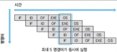

- 이상적인 경우 각 단계 하나는 한 cycle 내 완료된다. 다시 말하면 cycle마다 pipeline 단계가 진행된다.

   - 따라서 가장 긴 pipeline 단계가 processor의 clock 속도를 결정 짓는다.

   - cycle마다 instuction이 완료되는 셈이므로, IPC(Instruction Per Cycle)은 1이 된다.


---

### 7.3.1 fragmentation 줄이기

하지만 현실에서는 이상적인 pipeline 구현을 위한 조건부터 만족을 시키기 힘들다.(균등한 pipeline, 같은 작업 처리) 

예를 들어 instruction pipeline의 경우 크게 ALU instruction, load, store, branch로 나뉘면서 모두 처리해야 하는 작업이 달라진다.

> 게다가 구현하는 ISA의 특이성, processor에서의 구현 제약 등도 고려해야 한다.

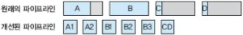

- 원래 pipeline: A, C, D에서 pipeline stall이 발생한다.

- 개선된 pipeline: A와 B를 두, 세 단계로 나누고, C와 D는 합쳐서 같은 단계로 바꿔서 균형을 맞췄다.

대신 어떤 pipeline 단계를 합치거나 나누는 등의 처리로 최대한 pipeline 단계 사이에 균형을 맞추려는 시도를 적용한다. 서로 다른 작업들도 최대한 같은 부분을 찾아 통합하면서 불균형을 줄인다.

> 마치 software에서 process가 필요한 양보다 더 큰 memory를 할당받아서, memory 공간이 낭비되는 상황인 **Internal Fragmentation**(내부 단편화)와 문제가 비슷하다. 

예를 들어 RISC 구조상 Instruction Fetch와 Instruction Decoding 과정을 간단하게 처리할 수 있으므로 두 단계가 합쳐질 수 있다. 

반면 x86 processor는 가변 길이를 갖는 instruction을 읽어야 하며, 복잡한 instruction format과 uop로 변환 과정까지 거쳐야 하므로, IF, ID 과정에서 처리해야 하는 일이 많다. 따라서 오히려 여러 단계로 나눠서 pipeline의 균형을 맞추도록 해야 한다.

> 실제로 x86 processor는 IF와 ID 과정이 더 세밀하게 pipeline화되어 있다.

그런데 Operand Fetch, Instruction Execution(EXE), Operand Store 과정은 instruction 종류에 따라 처리 과정이 달랐다. 따라서 불균형이 발생하게 된다.

- Operand Fetch 단계에서 register를 읽는 작업, memory를 읽는 작업을 모두 포함했다. 하지만 memory를 읽는 작업은 cache가 있어도 register에 비해 훨씬 느리게 수행된다. 따라서 이 둘을 구분 짓는 것이 더 효율적이다.

- EXE 단계도 floating point 연산보다 간단한 integer 연산이 빠를 것은 자명하다. 따라서 별도의 pipeline 단계로 구분하는 편이 더 효율적이다.


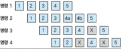


- instruction 1과 3은 다섯 단계가 필요하다.

- instruction 2는 4번째 단계가 4a와 4b로 두 단계가 필요하다.

- 따라서 instruction 3이 5단계를 실행하고 싶어도, 아직 instruction 2가 해당하는 자원을 사용하면서 pipeline stall이 발생하게 된다.

  > 이런 자원 부족에 따른 현상을 **structural hazards**(구조 해저드)라고 한다.

이렇게 서로 다른 instruction에 의해 결국 다른 pipeline 단계를 사용하게 되므로, 이로 말미암아 pipeline stall이 발생할 수 있다.

> software에서 요청을 만족할 만한 memory가 남아있어도, 많은 hole들로 조각나 있어서 새 process를 할당할 수 없는 경우인 external fragmentation 문제와 비슷하다.

즉, internal/external fragmentation을 최소화하는 방향으로 pipeline 단계를 결정해야 한다.

---

### 7.3.2 최적의 pipeline depth

pipeline 단계를 정의할 때는 최적의 pipeline 단계 수, 즉 depth도 같이 고려해야 한다. 앞서 보았듯이 (가장 긴) pipeline depth가 곧 processor의 clock 속도를 결정하기 때문에, 성능에 큰 영향을 미치는 중요한 설계 변수다.

> 앞서 Instruction 처리를 다섯 단계로 나눴으며, MIPS R2000/3000 processor도 실제 다섯 단계의 pipeline으로 구성되어 있다. 초기 펜티엄 processor 또한 마찬가지였다. 현대는 10단계 이상이다.

pipeline의 한 단계는 한 cycle 내 완료되어야 하므로, pipeline 단계를 더 잘게 나눠서 수를 늘리면(depth가 커지면) 각 단계에서 해야 할 일이 줄어들게 된다. 즉, 보다 빠른 clock을 얻을 수 있다.

---

## 7.4 pipeline hazard

이상적인 pipeline은 투입되는 작업 간에 dependence가 없다고 가정한다. 하지만 실제 program은 그럴 수 없기 때문에, 최대한 dependence를 줄이는 방향으로 해결해야 한다.

pipeline processor에서 dependence 때문에 발생하는 문제를 **pipeline hazard**라고 한다. 이런 문제를 해결하는 가장 간단한 방법은 pipeline을 stall(멈추기)하는 것이지만, 좋은 해답은 아니다.

pipeline hazard는 종류에 따라 세 가지로 나뉜다.

---

### 7.4.1 structural hazard

**structural hazard**(구조 해저드)란 processor의 자원이 부족해서 발생하는 stall이다. 따라서 자원을 늘리면 hazard를 해결할 수 있다.

하지만 이를 위해서는 필요한 컴포넌트의 추가 비용을 살펴야 한다. pipeline stall을 방지하려면 register file, ALU, memory와 같은 모든 device가 pipeline 단계만큼의 instruction을 처리할 수 있어야 한다.

예시로 register file을 보자. ALU instruction은 보통 두 개의 argument를 register file에서 읽고 최종 결과를 저장하게 된다. 그런데 pipeline processor라면 operand fetch 단계와, operand store(WB) 단계 instruction가 동시에 작동해야 한다.

다시 말해 register는 반드시 최대 두 개의 load와 한 번의 store를 동시에 처리할 수 있어야 하며, 이 작업이 cycle마다 가능하게 지원해야 한다. 그러나 register file에 load/store를 동시에 처리하도록(멀티 포트화) 만드는 작업은 굉장히 어렵다. 내부 공간이나 전력도 많이 소비하게 된다.

cache나 memory device도 이와 같은 문제를 가진다. 대안으로는 적은 수의 load/store port를 갖는 컴포넌트를 여러 개 배치하는 방법을 쓸 수 있다.

> cache의 경우 이런 대안에서의 단위를 **bank**, register file은 **cluster**라고 부른다.

---

### 7.4.2 control hazard

앞서 structural hazard와 다르게, control/data hazard는 dependence에 의해 발생한다.

Instruction Fetch 단계에서 PC가 가리키는 address에서 instruction을 읽어야 했으나, 아래 예시처럼 branch로 구성된 code라면 이를 처리하기 어렵게 된다.

```c
if (z > 0) goto 4;    // 1번
a = 1;                // 2번
goto 5;               // 3번
a = 0;                // 4번
x = y + z;            // 1~4번 instruction과 무관하다.
```

- 1번 conditional branch statement를 구하지 않고서는, 2번 instruction을 인출할지 4번 instruction을 인출할지 알 수 없다. 즉, branch statement의 결과가 나올 때까지 기다려야 한다.

앞서 IF, ID, OF, EXE, OS처럼 pipeline을 5단계로 구성했다면, EXE 단계를 지나야 branch statement의 결과를 알 수 있을 것이다. 

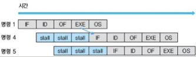

- EXE 단계가 수행될 때까지 3cycle만큼 stall이 발생했다.

- 사실 5번 instruction는 instruction reordering(명령어 재배치)를 통해 stall을 없앨 수 있다.

branch statement는 거의 4~5 instruction마다 나올 정도로 흔하기 때문에 이를 방치하면 큰 손해로 번진다.

이를 방지하기 위해 OF에서 condition을 파악하게 하고, compiler를 통해 (5번을) instruction reordering을 거치면 다음과 같이 변한다.

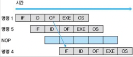

- **NOP**(NO Operation) : 아무 일도 하지 않는다. (5번 instruction가 마지막이므로)

- 이런 기법을 **delayed slot**(지연 슬롯)이라고 한다.

하지만 완벽하게 pipeline stall을 제거할 수 없었으며, 실제 program과는 다르게 진행되므로 혼동이 생길 수 있다. 이런 문제까지 해결하기 위해 나온 기법이 바로 **branch prediction**(분기 에측)이다.

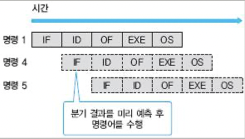

> branch prediction란 branch 결과를 미리 점치는 기술이다. 이 branch가 분기를 할지 안 할지를 미리 예측해서, (한다고 예측하면) 바로 다음 cycle에 4번 instruction을 인출할 수 있다.

> 따라서 예측이 옳으면 성능 향상으로 이어지겠지만, 만약 틀리면 pipeline을 비우고 다시 진행해야 한다.

---

## 7.4.3 data hazard

**data hazard**는 RAW/WAW/WAR data dependence과 memory dependence로 발생한다.

아래 예시에서 IF, ID, OF, EXE, OS에서, OF 단계를 register와 memory 접근을 서로 분리했다고 가정하자. 따라서 6개의 pipeline을 갖는다.

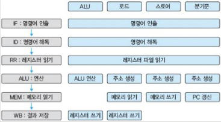

- memory load/store는 register 읽기(RR) 단계에서 base point address나 offset을 읽고, ALU 단계에서 address를 계산해서 만든다.

> 모든 연산이 이 과정을 거치지 않는다는 점에 유의하자.

다음 기계어를 처리한다고 가정하자.

```c
r1 = r2 + 1;
r3 = r1 + 1;    // 2번: RAW dependence
r4 = r1 + 2;    // 3번: RAW
r5 = r1 + 3;    // 4번: RAW
```

- 2,3,4번 instruction은 1번 instruction에 RAW dependence를 갖는다.

   - 이처럼 instruction이 바로 뒤따르면서 RAW hazard를 가지는 경우, 이런 instruction을 흔히 **Back-to-Back** dependence를 가졌다고 말한다.

- 1번 instruction은 OS(WB) 단계를 거쳐야 register file에 최종 r1 값을 저장할 텐데, 따라서 그동안 2번 instruction은 값을 읽지 못해 stall이 발생한다.

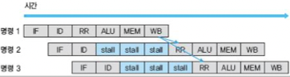

그런데 꼭 1번 instruction이 WB를 마칠 때까지 기다릴 필요는 없다. 만약 ALU 단계의 값을 바로 2번 instruction에 전달할 수 있다면 pipeline stall을 막을 수 있다.

이런 기법을 **bypass**(우회로)라고 한다. 2번 instruction은 data hazard가 있을 때, register에서 값을 읽지 않고 bypass에서 바로 값을 취해서 연산을 수행하게 된다.

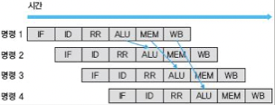

- 1번 ALU 단계에서 2번 ALU 단계로 bypass를 이용해 operand를 제공한다.

- 1번 MEM 단계에서 3번 ALU 단계로 bypass를 이용해 operand를 제공한다.

- 1번 WB 단계에서 4번 ALU 단계로 bypass를 이용해 operand를 제공한다.

위 예제에서 3번, 4번 instruction에 ALU 대 ALU로 bypass를 형성하지 않은 이유는, 단계 사이의 cycle이 존재하기 때문이다. 시간적으로 2~3 단계 cycle 간격이 존재하게 되면 별도의 buffer에 값을 담아 저장해야 하는 문제가 생긴다.

위 과정을 pipeline 위에 직접 그리면 일종의 loop로 보이게 된다. 이처럼 pipeline에서의 data flow는 단방향만이 아니라 feedback도 존재할 수 있다.

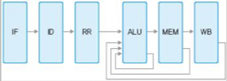

정리하자면 data hazard를 막기 위해서는 반드시 back-to-back instruction이 stall 없이 처리될 수 있도록 pipeline 단계와 bypass 로직을 만들어야 한다.

> WAW/WAR dependence는 최종 결과를 쓰는 작업에 영향을 미치기 때문에 실제로는 hazard를 만들지 않는다.

앞서 본 hazard와 비슷하게 memory load로 인한 RAW dependence도 hazard를 만든다. 이를 **Load-Use data hazard**라고 부른다.

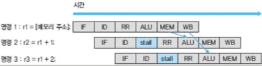

- memory load는 ALU 단계가 아닌 MEM 단계가 되어야 비로소 값을 읽을 수 있다.

- 그러나 2번 instruction은 ALU 단계에서 이 값이 필요하므로, bypass를 이용하더라도 pipeline stall이 하나 발생하게 된다.

> 실제 고성능 processor는 이런 stall도 방지하게 설계한다.

---

## 7.5 pipeline을 통한 software parallelize

pipeline은 software에도 적용할 수 있다. 

예시로 Ferret이라는 '주어진 디렉터리나 DB의 이미지를 비교'하는 program의 직렬 버전 code를 살펴 보자.

```c
void scan(void) {
   while (주어진 디렉터리 내 image를 재귀 호출로 탐색) {
      do_query;
   }
}

void do_query(const char *file_name) {
   ...
   image_read_rgb_hsv(name, &width, &height, &RGB, &HSV);    // 이미지를 읽는다.
   ...
   image_segment(&mask, &nrgn, RGB, width, height);    // 이미지를 구획화한다.
   ...
   image_extract_helper(HSV, mask, width, height, nrgn, &ds);    // 이미지를 추출한다.
   ...
   cass_result_alloc_list(&result, ...);
   cass_table_query(table, &query, &result);
   ...
   cass_result_merge_lists(&result, ...);
   cass_table_query(query_table, &query, &result);
   cleanup(...);
}
```

이 program은 모든 image에 do_query를 호출하는 간단한 구조이다. 그렇다면 이 작업을 어떻게 parallelize할 수 있을까?

간단히 생각하면 scan() function 자체를 parallelize하는 방안을 생각할 수 있다. 처리할 디렉터리를 먼저 나누고, 여러 thread를 이용해서 각각 scan() function을 호출하면 간단히 만들 수 있다.

> 그러나 만약 어떤 순서에 따라 디렉터리 내 image를 처리해야 한다면 쉽게 parallelize할 수 없을 것이다. 

하지만 이 단순한 방법은 고려하지 않은 문제가 있다. 바로 hard disk나 DB가 병목 지점이 될 수 있다는 점이다. scan() function을 parallelize해도 정작 hard disk나 DB에서 parallel로 image를 읽을 수 없다면 의미가 없는 셈이다.

따라서 scan() function의 while loop뿐만 아니라, do_query() function 자체도 parallelize하는 것이 합리적이다.

do_query() function은 이미지 읽기(image_read), 이미지 구획(image_segment), 이미지 추출(image_extract), 벡터 작업, 최종 순위 산정(rank)으로 나뉜다. 따라서 각 단계를 pipeline을 도입해 효율적으로 처리할 수 있다.

1. thread를 다섯 개 만들고, 각 thread에서 do_query() 내 다섯 단계를 각각 나눠서 처리하는 code를 만든다.

2. thread 사이에서 서로 data를 공유할 수 있어야 하며, pipeline에서도 단계마다 data를 넘겨주는 register나 queue가 필요하다. 따라서 thread 사이마다 shared queue를 구성한다.

   - 이 queue는 두 thread가 동시에 접근하므로 **mutex**(뮤텍스) 같은 동기화 객체를 사용해서 작성하거나, lock-free 자료구조를 사용해야 한다.

   - queue가 일종의 동기화 역할을 하며 pipeline 단계가 서로 기어처럼 맞물리게 한다.

이번에는 위 요소를 구현한 parallel 버전을 보자.

```c
// 각 pipeline 단계에서 공유하는 queue. mutex로 보호한다.
QUEUE q_load_seq, q_seg_extract, q_extract_vec, q_vec_rank;

int LoadThread(void* dummy) {
   for (;;) {
      /* pipeline 첫 단계이므로 공유 queue에서 data를 읽을 필요가 없다. */
      load_data* load = allocate(...);
      image_read_rgb_hsv(name, &load->width, &load->height, ...);
      /* 공유 queue를 이용해 load를 넘긴다. */
      queue_enqueue_wait(&q_load_seq, data);
   }
}

int SegThread(void* dummy) {
   for (;;) {
      /* 앞 단계 결과를 가져온다. */
      load_data* load = queue_dequeue_wait(&q_load_seg);
      seg_data* seg = allocate(...);
      image_segment(&seg->mask, &seg->nrgn, load->width, load->height, ...);
      /* 다음 단계로 결과를 전달한다. */
      queue_enqueue_wait(&q_seg_extract, seg);
   }
}

int ExtractThread(void* dummy) {
   // SegThread처럼 구현한다.
}

int VectorThread(void* dummy) {
   // SegThread처럼 구현한다.
}

int RankThread(void* dummy) {
   for (;;) {
      vec_data* vec = queue_dequeue_wait(&q_vec_rank);
      //... 작업
      /* pipeline 마지막 단계이므로 더 이상 공유 queue에 넣을 필요가 없다. */
   }
}

// main function에서 앞서 만든 Load/Seg/Extract/Vector/Rank thread를 생성해 호출한다.
// ...
```

- LoadThread가 image를 읽으면 그 결과를 (Load와 Seg 단계 사이의 공유 queue인) q_load_seg에 저장한다.

- LoadThread가 data를 공유 queue에 넣으면, SegThread가 data를 가져와 image_segment를 수행한다. 그리고 그 결과를 (Seg와 Extract 단계 사이의 공유 queue인) q_seg_extract에 저장한다.

- 이런 과정을 반복하여 data를 저장한다.

> 이런 software parallelize는 특히 오디오/비디오 코덱 또는 압출 프로그램과 같은 streaming program에 유용하다. 실제 음성 및 동영상 코덱(MPEG2, H.264)은 이런 pipeline으로 parallelize가 가능하다.

> 명령창에서 '|'로 표현되는 pipe로 여러 program을 연결하면 강력한 작업도 가능하다. 'ps -aux | grep root | wc -|'와 같은 instruction에서, 'ps -aux'의 출력이 'grep root의 입력으로 흐른다. 그리고 'grep root'의 출력은 다시 'wc -|'로 입력된다.

---
