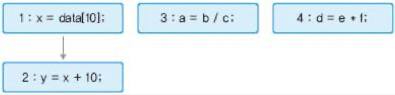

# 8 비순차 실행

이전 장까지의 pipeline은 program이 순서대로 실행될 것이라고 생각했다. 이런 방식을 **in-order** processor라고 부르며, 직관적이나 큰 단점을 하나 가지고 있다.

아래 예시를 보자.

```c
x = data[10];    // 1번
y = x + 10;      // 2번
a = b / c;       // 3번
d = e * f;       // 4번
```

1번 load instruction이 CPU 내 cache에서 data를 찾지 못하고, main memory에서 data를 가져와야 한다고 하자. 그렇다면 보통 컴퓨터에서 이 작업은 100 cycle이 넘는 시간이 걸리게 된다.

> 덧셈 같은 단순한 integer 연산이 한 cycle마다 완료될 수 있다는 사실과 비교하면 매우 긴 시간이다.

게다가 3번과 4번 instruction은 1번과 아무 연관이 없다. 따라서 1번 instruction이 완료되지 못하고 기다리는 상황에 3번, 4번을 처리할 수 있으면 시간을 단축시킬 수 있을 것이다.

따라서 processor가 직접 instruction 사이의 dependence를 분석하고, 먼저 실행할 수 있는 instruction을 미리 실행시키는 방법을 바로 **out-of-order** execution(OOO 혹은 OOOE. 비순차 실행)이라고 한다.

더 나아가서 instruction throughput을 높일 수 있는 방법이 있다. 4번도 나머지 instruction과 무관하므로 pipeline을 늘려서 3, 4번을 parallel로 처리하면 된다. 이런 구조를 **superscalar**(슈퍼스칼라) processor라고 한다.

---

## 6.1 Instruction Level Parallelism

out-of-order execution은 **ILP**(Instruction Level Parallelism. 명령어 수준 병렬성)을 찾아서, 원래 순서가 아닌 data의 flow에 따라 instruction을 처리한다.

우선 **parallelism**(병렬성)의 대표적인 예로 multi thread나 multicore를 먼저 떠올릴 수 있다. 두 개의 independent한 thread가 있다면, 이 두 thread는 동시에 작동한다. single core processor에서도 OS의 time division(시분할) multitasking 기능 덕분에 논리적으로는 동시에 실행되는 것처럼 보인다. 이런 parallelism을 **TLP**(Thread-level parallelism. 스레드 수준 병렬성)이라고 한다.

> 요약하자면 TLP는 프로그래머가 명시적으로 multi thread로 program을 작성했을 때 얻는 parallelism이다.

하지만 프로그래머가 multi thread로 작성하지 않은 일반적인 single thread program에서도, 동시에 실행 가능한 instruction을 찾을 수 있다. 다시 말해 TLP보다 규모가 작은 parallelism이 있다는 뜻이다. 아래 예시를 보자.

```c
x = y + 1;    // 1번
a = b * 2;    // 2번
```

- 모든 variable은 pointer가 아닌 int/float 같은 scalar type이라고 가정한다.

1번과 2번 instruction은 동시에 실행 가능하다. 둘 중 어느 것이 먼저 실행되든, 동시에 실행되든 program의 context에는 차이가 없다.

> **context**란 1번, 2번 instruction을 완료했을 때의 computer architectural state(컴퓨터 구조 상태)를 가리킨다.

다시 말해 1, 2번을 어떤 순서로 실행해도 이 program의 **semantic**(의미)를 정확하게 실행한다. data dependence만 지키면 실제 실행 순서는 바뀌어도 큰 문제가 없다. 바로 이것이 ILP이다.

> 하지만 주의할 점은 어떤 연산은 flag register의 value를 변경시키기 때문에, <U>flag value를 변경시키거나 이를 이용하는 연산은 별개의 dependence를 유발</U>한다.

> 일반적으로 과학 계산 program에서 ILP를 매우 많이 발견할 수 있지만, 그렇지 않은 program 역시 다양하다. 

이번 ch08 첫 예시로 본 code를 graph로 그려서 ILP를 나타내 보자.



- 1번, 2번: variable x에 RAW data dependence를 갖는다.

   - 따라서 서로 edge(간선)으로 dependence를 표현한다.

- 3번, 4번은 아무런 관련이 없다.

   - 따라서 그냥 vertex(정점)으로만 그려진다.

만일 모든 instruction이 한 cycle 안에 달성되고, ILP를 찾아서 parallel로 실행한다면 2 cycle이면 모두 완료할 수 있을 것이다.(in-order로 처리했다면 4 cycle이 걸릴 것이다.) 즉, 이 program의 ILP는 4/2 = 2라고 할 수 있다.

> 만약 모든 instruction이 dependence로 묶여 있었다면 ILP는 4/4 = 1이었을 것이다.

ILP를 계산하려면 위처럼 dependence graph를 그린 뒤, root node에서 leaf node까지 가장 긴 경로의 길이를 구한다. 즉, 우선 **critical path**(임계 경로)를 구한다. 그 다음 전체 instruction 개수에 나누면 된다.

> IPC(Instruction Per Cycle)와 혼동해서는 안 된다. 에초에 ILP는 program의 고유한 성격에 해당하고, IPC는 processor의 구현 방식에 좌우된다.

OOOE는 **scheduling**(스케줄링) 관점에서 볼 수 있다. OOOE는 instruction 사이의 dependence를 파악해서 dynamic하게 scheduling한다. 그래서 OOOE를 **dynamic scheduling**(동적 스케줄링) 기법이라고 부른다. 또한 ILP는 hardware가 아닌 software(compiler)가 대신 찾아줘도 된다.

---