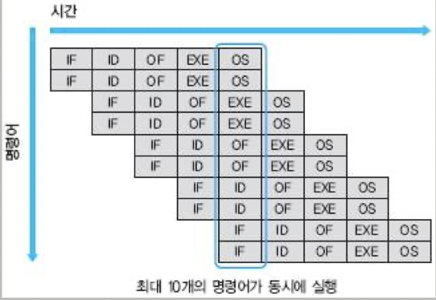
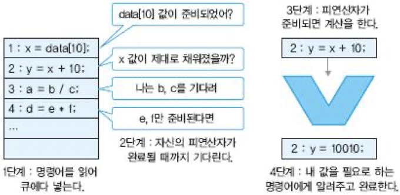

# 8 비순차 실행

이전 장까지의 pipeline은 program이 순서대로 실행될 것이라고 생각했다. 이런 방식을 **in-order** processor라고 부르며, 직관적이나 큰 단점을 하나 가지고 있다.

아래 예시를 보자.

```c
x = data[10];    // 1번
y = x + 10;      // 2번
a = b / c;       // 3번
d = e * f;       // 4번
```

1번 load instruction이 CPU 내 cache에서 data를 찾지 못하고, main memory에서 data를 가져와야 한다고 하자. 그렇다면 보통 컴퓨터에서 이 작업은 100 cycle이 넘는 시간이 걸리게 된다.

> 덧셈 같은 단순한 integer 연산이 한 cycle마다 완료될 수 있다는 사실과 비교하면 매우 긴 시간이다.

게다가 3번과 4번 instruction은 1번과 아무 연관이 없다. 따라서 1번 instruction이 완료되지 못하고 기다리는 상황에 3번, 4번을 처리할 수 있으면 시간을 단축시킬 수 있을 것이다.

따라서 processor가 직접 instruction 사이의 dependence를 분석하고, 먼저 실행할 수 있는 instruction을 미리 실행시키는 방법을 바로 **out-of-order** execution(OOO 혹은 OOOE. 비순차 실행)이라고 한다.

더 나아가서 instruction throughput을 높일 수 있는 방법이 있다. 4번도 나머지 instruction과 무관하므로 pipeline을 늘려서 3, 4번을 parallel로 처리하면 된다. 이런 구조를 **superscalar**(슈퍼스칼라) processor라고 한다.

---

## 8.1 Instruction Level Parallelism

out-of-order execution은 **ILP**(Instruction Level Parallelism. 명령어 수준 병렬성)을 찾아서, 원래 순서가 아닌 data의 flow에 따라 instruction을 처리한다.

우선 **parallelism**(병렬성)의 대표적인 예로 multi thread나 multicore를 먼저 떠올릴 수 있다. 두 개의 independent한 thread가 있다면, 이 두 thread는 동시에 작동한다. single core processor에서도 OS의 time division(시분할) multitasking 기능 덕분에 논리적으로는 동시에 실행되는 것처럼 보인다. 이런 parallelism을 **TLP**(Thread-level parallelism. 스레드 수준 병렬성)이라고 한다.

> 요약하자면 TLP는 프로그래머가 명시적으로 multi thread로 program을 작성했을 때 얻는 parallelism이다.

하지만 프로그래머가 multi thread로 작성하지 않은 일반적인 single thread program에서도, 동시에 실행 가능한 instruction을 찾을 수 있다. 다시 말해 TLP보다 규모가 작은 parallelism이 있다는 뜻이다. 아래 예시를 보자.

```c
x = y + 1;    // 1번
a = b * 2;    // 2번
```

- 모든 variable은 pointer가 아닌 int/float 같은 scalar type이라고 가정한다.

1번과 2번 instruction은 동시에 실행 가능하다. 둘 중 어느 것이 먼저 실행되든, 동시에 실행되든 program의 context에는 차이가 없다.

> **context**란 1번, 2번 instruction을 완료했을 때의 computer architectural state(컴퓨터 구조 상태)를 가리킨다.

다시 말해 1, 2번을 어떤 순서로 실행해도 이 program의 **semantic**(의미)를 정확하게 실행한다. data dependence만 지키면 실제 실행 순서는 바뀌어도 큰 문제가 없다. 바로 이것이 ILP이다.

> 하지만 주의할 점은 어떤 연산은 flag register의 value를 변경시키기 때문에, <U>flag value를 변경시키거나 이를 이용하는 연산은 별개의 dependence를 유발</U>한다.

> 일반적으로 과학 계산 program에서 ILP를 매우 많이 발견할 수 있지만, 그렇지 않은 program 역시 다양하다. 

이번 ch08 첫 예시로 본 code를 graph로 그려서 ILP를 나타내 보자.


- 1번, 2번: variable x에 RAW data dependence를 갖는다.

   - 따라서 서로 edge(간선)으로 dependence를 표현한다.

- 3번, 4번은 아무런 관련이 없다.

   - 따라서 그냥 vertex(정점)으로만 그려진다.

만일 모든 instruction이 한 cycle 안에 달성되고, ILP를 찾아서 parallel로 실행한다면 2 cycle이면 모두 완료할 수 있을 것이다.(in-order로 처리했다면 4 cycle이 걸릴 것이다.) 즉, 이 program의 ILP는 4/2 = 2라고 할 수 있다.

> 만약 모든 instruction이 dependence로 묶여 있었다면 ILP는 4/4 = 1이었을 것이다.

ILP를 계산하려면 위처럼 dependence graph를 그린 뒤, root node에서 leaf node까지 가장 긴 경로의 길이를 구한다. 즉, 우선 **critical path**(임계 경로)를 구한다. 그 다음 전체 instruction 개수에 나누면 된다.

> IPC(Instruction Per Cycle)와 혼동해서는 안 된다. 에초에 ILP는 program의 고유한 성격에 해당하고, IPC는 processor의 구현 방식에 좌우된다.

OOOE는 **scheduling**(스케줄링) 관점에서 볼 수 있다. OOOE는 instruction 사이의 dependence를 파악해서 dynamic하게 scheduling한다. 그래서 OOOE를 **dynamic scheduling**(동적 스케줄링) 기법이라고 부른다. 또한 ILP는 hardware가 아닌 software(compiler)가 대신 찾아줘도 된다.

> 한편 computer architecture 중에서 **dataflow**(데이터플로우)라는 전통적인 방식과 매우 상이한 처리 방식이 있다. dataflow는 OOOE의 이상적인 모습에 해당한다.

---

## 8.2 superscalar pipeline

**superscalar**(슈퍼스칼라)를 간단히 말하면 pipeline이 여러 개 있어서 동시에 instruction을 처리할 수 있는 구조를 뜻한다.



이전까지 본 pipeline processor는 pipeline이 하나밖에 없어서, 1 cycle에 최대 instruction 1개만 완료할 수 있었다.(IPC = 1)

하지만 위 그림처럼 pipeline이 두 개가 되면서 이상적인 상황이라면 cycle마다 최대 두 개의 instruction이 **issue**(투입)과 **graduation**(retirement. 완료)가 가능하다.(IPC = 2)

> 보통 superscalar processor는 동시에 issue/graduation 가능한 instruction 개수에 따라 N-issue, N-wide, N-way superscalar로 표현한다.

이상적으로는 N개의 instruction을 fetch하여 pipeline에 넣을 수 있지만, 실제로는 instruction cache의 제약, dependence, branch 때문에 대체로 N개보다 작은 instruction을 fetch할 수 있다.

그런데 superscalar processor라는 개념은 오직 instruction pipeline이 여러 개 복제되어 있는 것만을 의미한다. in-order인지, out-of-order인지 여부는 무관하다. 하지만 out-of-order processor로 좋은 성능을 내려면 superscalar로 만들어야 한다.(따라서 오인하기 쉽다.)

> 다시 말해 out-of-order processor도 superscalar가 아닌 1-wide processor일 수도 있다. 반면 in-order processor가 superscalar일 수 있다.

superscalar processor 구현에는 어려움이 따른다. N-wide processor라면 최대 N개의 instruction을 fetch해야 하지만, instruction cache가 이를 손쉽게 해결하지는 못한다. instruction이 제대로 정렬되지 않았거나, 다른 cache line에 걸쳐 있는 등의 상황이 발생하기 때문이다. 또한 앞서 말한 것처럼 branch가 끼어 있다면 문제가 더 어려워진다. bypass logic 역시 복잡해진다. superscalar는 이런 문제도 N배로 커지는 것이다.

---

## 8.3 OOOE 구현: Tomasulo Algorithm

out-of-order superscalar processor는 주어진 instruction에서 ILP를 찾아 실행 가능한 instruction부터 처리한다. 그런데 이를 처리하는 algorithm은 어떻게 가능할까? 핵심은 instruction scheduling에 있다는 점을 상기해 보자.

```c
x = data[10];    // 1번
y = x + 10;      // 2번
a = b / c;       // 3번
d = e * f;       // 4번
```

앞서 본 예제를 다시 살펴보자. 편의상 모든 variable(x, y, a, b, c, d, e, f)를 모두 register로 가정하자. data[10]은 어떤 data가 담긴 address를 뜻한다. 



1. 일단 instruction을 모두 fetch, decoding하여 어떤 queue에 넣어야 한다.(IF, ID 단계)

2. queue에서 대기하며 operand가 준비되는 것을 검사하며 기다린다.(scheduling 단계)

3. 준비가 다 되었으면 실제 계산을 수행한다.(EXE 단계)

4. 완료가 됐을 때 만약 지금의 연산 결과를 필요로 하는 instruction이 있다면 알려준다. 끝으로 instruction은 queue를 떠나고 프로그래머는 과정이 완료가 된 것으로 보인다.(OS 단계)

위 4단계를 예제에 맞게 설명하면 다음과 같다.

1. 1번 instruction은 queue를 하나 할당받아서 들어간다. 1번 register x에 value을 쓸 것이므로, 뒤에 따라오는 instruction들 중 x를 쓰는 instruction들에게 반드시 자신을 기다리라고 당부한다.

   - 예들 들어 register file에서 x의 value를 바로 읽지 못하게 한다.

   - 1번은 memory load이므로 cache에 이 data를 가져와달라고 요청한다. 허나 cache miss가 발생하면 긴 시간이 소요될 것이다.(지금 예제에서 발생했다고 가정하자.)

2. processor는 다음 instruction인 2번을 읽어 queue에 넣는다. 그런데 register x의 value가 필요하고, 이는 1번이 완료되어야 쓸 수 있도록 되어 있다. 따라서 1번을 계속 기다린다.

3. 3번 instruction이 queue에 들어온다. register b와 c를 읽어야 하는데 이번에는 그냥 읽을 수 있다. 따라서 processor는 ALU 하나를 할당해서 계산을 수행한다. queue에서는 이 instruction을 이제 빼내고 완료되었다는 사실을 전한다.

4. 4번 instruction도 3번처럼 처리된다.

5. cache miss에 의해 긴 시간이 소요되며 마침내 1번 instruction의 data가 도달한다. 1번은 이제 register file에 값을 갱신하고, 완료가 되면 이 사실을 queue에서 기다리는 instruction에게 알린다. 그러면 2번은 비로소 register x의 값을 읽울 수 있게 된다.

위 과정을 보면 data dependence에 따라 instruction이 scheduling 되었음을 알 수 있다. 이 algorithm이 OOOE의 기원인 **Tomasulo algorithm**(토마슐로 알고리즘)이다.

> 1967년 이 알고리즘을 구현한 Robert Tomasulo의 이름을 딴 것이다. 지금에 와서는 어느 정도 바뀌었지만 핵심은 그대로 남아 있다.

---

## 8.4 Instruction Window(명령어 윈도우)

현실에서 실제 program의 크기는 매우 크기 때문에, code 전체를 분석해 이상적인 ILP를 찾는 것은 hardware의 제약으로 불가능에 가깝다. 따라서 out-of-order processor에서 찾는 ILP는 상대적으로 매우 제한된 범위 내에서 찾는다. **Instruction Window**(명령어 윈도우)가 바로 이 범위를 가리키는 개념이다.

예를 들어 128개의 instruction window를 갖는다는 말은 128개의 instruction 속에서 ILP를 찾을 수 있다는 뜻이다. 다르게 말하면 128개의 instruction을 잠시 들고 있으면서 OOOE를 수행한다는 말이기도 하다.


instruction window는 보통 연속적으로 움직인다. 내부에서 가장 오래된 instruction이 완료되면 한 칸씩 이동하게 된다. 이 instruction window 안에 있는 instruction을 **in-flight**(인-플라이트) instruction이라고 표현하기도 한다.

> instruction window는 hardware의 제약을 받아 보통 100여개가 넘는 정도에서 ILP를 탐색하지만, compiler가 software 관점에서 수천 개의 instruction 사이에서 최적의 ILP을 찾는다.

---
