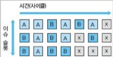

# 9 하이퍼스레딩

**hyper-threading**은 intel이 펜티엄 4에서 구현한 **Simultaneous Multi-Threading**(SMT)의 상품명이다. 간단히 말하면 physical processor(core) 하나가 두 개 이상의 logical processor로 동작하게 된다.(마치 single core가 dual core로 보이게 된다.)

> hardware level에서 두 개 이상의 thread가 동시에 실행되므로 hardware thread라는 표현을 쓰기도 한다.

> 하나의 physical processor를 두 개의 logical processor로 동작하게 구현한 것을 2-way SMT라고 부른다.

---

## 9.1 Simultaneous Multi-Threading

물리적으로 하나인 processor가 동시에 여러 개로 보일 수 있는 이유는, thread **context**(문맥)을 hardware가 동시에 여러 개를 지원할 수 있기 때문이다. superscalar processor에서 동시에 여러 thread에서 instruction을 가져와 pipeline에 넣게 된다. 

이전에는 일반적인 single core processor가 오직 한 thread만 처리할 수 있었다. 따라서 multi-tasking을 구현하기 위해서는 processor resource를 여러 thread에 돌아가면서 빌려주는 thread scheduling이 필요했다. 한 thread가 자신에게 할당된 시간동안 processor를 썼다면, OS는 processor를 빼앗아 다른 thread에 주게 된다. 이것이 **context switching**(문맥 교환)이다. 이때 context switching을 위해 이전 context를 저장하게 되면서 overhead가 발생하게 된다.

> 다시 말해 무작정 thread를 많이 만들면 context switching overhead 때문에 performance가 낮아진다.

참고로 여기서 말하는 context란 바로 computer architectural state를 가리킨다. 쉽게 말하면 현재 thread가 수행 중인 register의 값이다. Win32 API 중 `GetThreadContext`라는 function을 사용하면 아래처럼 thread의 context를 얻을 수 있다.(일부 편집)

```cpp
typedef struct _CONTEXT {
    // ...생략
    DWORD ContextFlags;
    FLOATING_SAVE_AREA FloatSave;

    // This section is specified/returned
    // if the ContextFlags word contains the flag CONTEXT_SEGMENTS.
    DWORD    SegGs, SegFs, SegEs, SegDs;

    // This section is specified/returned
    // if the ContextFlags word contains the flag CONTEXT_INTEGER.
    DWORD    Edi, Esi, Ebx, Edx, Ecx, Eax;

    // This section is specified/returned
    // if the ContextFlags word contains the flag CONTEXT_CONTROL.
    DWORD    Ebp, Eip, SegCs, EFlags, Esp;

    // ... 생략
} CONTEXT;
```

이와 같이 thread context의 핵심은 결국 register의 집합이다. 이전까지 다룬 processor에서는 register file이 단 하나만 있었던 것이다. register 값은 context switching 과정에서 memory로 잠시 쫓겨 났다가 이후 복구된다. 

그러나 hardware multi-threading은 thread context를 유지하는 register를 복제하고 동시에 여러 thread context를 유지한다. 따라서 context switching 과정에서 cost가 거의 들지 않으면서 여러 thread를 처리할 수 있다.

게다가 multi-threading이 효과적인 이유로 context switching보다 더 근본적인 것이 있다. 바로 ILP보다 더 높은 level의 parallelism인 **Thread-Level Parallelism**(TLP. 스레드 수준 병렬성)이다. thread 간에 **mutex**(뮤텍스)나 **critical section**(임계 영역)을 이용해 서로 직렬로 수행되어야 하지 않는 이상, 여러 thread는 완벽하게 independent하게, 즉 parallel로 실행될 수 있다.

> 다시 말해 hardware multi-threading은 TLP를 최대한 활용하는 방법이다.

> 또한 resource efficiency를 극대화하는 기술로 볼 수 있다. OOOE가 in-order execution보다 (energy efficiency를 고려하지 않는다는 가정 하에) 더 나은 performance를 보인 이유는 낭비되는 cycle을 줄였기 때문이다. 예를 들어 in-order execution에서는 한 instruction이 cache miss를 일으키면 상당한 시간이 소요되지만, OOOE는 무관한 instruction을 먼저 처리하는 것으로 cycle 낭비를 막을 수 있었다.

---

## 9.2 multi-threading의 종류

다음은 3-wide superscalar processor의 도식이다.


- X 표시: processor pipeline에서 일을 하지 않는(즉, 낭비되고 있는) **issue slot**이다.

  > issue slot이란 쉽게 말하면 pipeline에 instruction을 넣을 수 있는 입구를 의미한다. 

위 그림을 보면 한 cycle에 최대 3개의 instruction을 넣을 수 있지만, program 자체가 가진 ILP로 생기는 제한 등 여러 문제로 낭비가 발생할 수 있다.(설명을 위해 이런 낭비를 수평 방향의 낭비라고 지칭하자.) 

혹은 어떤 cycle에서는 아예 instruction의 issue가 불가능할 수 있다. 예를 들어 critical path에 있는 instruction이 cache miss를 겪고 있는데, 이때 찾을 수 있는 ILP가 없다면 이런 사태가 발생할 수 있다.(이를 수직 방향의 낭비라고 지칭하자.)

> 이처럼 instruction throughput가 높은 OOOE라도 제대로 활용되지 않는 pipeline execution이 많을 수 있다.

이때 multi-threading은 특히 수직 방향의 낭비를 줄일 수 있다. 이 공간에 다른 thread의 instruction을 넣으면 되기 때문이다. 이런 multi-threading은 여러 thread에서 instruction을 읽는 방식에 따라 다음과 같이 분류할 수 있다.

> [선점형/비선점형 스케줄링](https://umbum.dev/60)

- **fine-grained**(미세 단위) multi-threading

    

    OS의 **non-preemptive** scheduling(비선점형 스케줄링) 기법과 흡사하다. 
    
    일정 cycle 동안 번갈아가며 processor가 다른 thread에서 instruction을 가져와 pipeline에 넣는다.
    
    가장 미세하게 만든다면 매 cycle마다 hardware thread를 돌아가며 instruction을 가져오게 된다.

    - 그림에서는 cycle마다 다른 thread A,B에서 instruction을 fetch한다. 앞서 본 3-wide superscalar 도식과 비교하면 수직 방향의 낭비가 줄어든 것을 알 수 있다.

- **coarse-grained**(큰 단위) multi-threading

    

    정의에 따라 여러 방식으로 구현할 수 있다. 예를 들어 하나가 아닌 여러 cycle 단위를 사용할 수도 있다. 
    
    하지만 그보다는 어떤 thread에서 cache miss 같은 일이 발생해 instruction을 issue할 수 없을 때, context를 다른 thread로 전환하는 방식이 일반적이다.

    > 이처럼 특정 event, 즉 latency가 긴 instruction이 걸렸을 때 scheduling이 일어난다 하여 **Switch-On-Event** multi-threading으로 지칭하기도 한다.

    - 그림에서는 thread A에서 instruction을 계속 fetch하다가, 어느 순간 cache miss로 thread A에서 instruction을 더 이상 fetch할 수 없는 상황이 발생한 것이다. processor는 ready 상태의 thread B에 processor를 사용할 수 있는 기회를 준다.

    - 따라서 context switching overhead가 거의 없다.(NVIDIA GPU와 비슷한 방식)

- **simultaneous**(동시) multi-threading

    

    multi-threading의 극단적인 형태로, 매 cycle마다 여러 thread에서 '동시에' instruction을 가져와서 pipeline에 넣는다.

    > 앞서 fine-grained, coarse-grained multi-threading(둘을 묶어서 Temporal Multi-Threading으로 지칭하기도 한다.)이 수직 방향의 낭비는 효율적으로 줄이나, 수평 방향의 낭비는 줄이지 못했다. 하지만 simultaneous multi-threading은 이 문제를 해결한다.(완전히 해결할 수 있는 건 아니다.)

    - 그림에서 수평 방향의 낭비를 다른 thread의 instruction을 가져와 해결하는 것을 볼 수 있다.

---

## 9.3 simultaneous multi-threading의 구현

simultaneous multi-threading은 processor resource가 생각보다 덜 활용된다는 점에서 제안된 개념이다. 살펴보면 대부분 cache miss, TLB(Translation Lookaside Buffer) miss, memory load latency, ILP 등에 의해 낭비되었다. 따라서 낭비를 줄이고 processor resource를 더 활용하는 방법을 제안한 것이다.

> overload의 원인이 cache miss가 압도적이라면 cache를 늘리거나 policies를 개선하기만 하면 되겠지만, 각 program마다 overload가 생기는 원인이 제각각 다르기 때문에 공통적인 해결책이 필요했다.

> 또한 Compaq나 intel에서 새롭게 SMT를 구현하는 데 hardware에서 필요한 면적은 기존의 약 6%, 5%로 크지 않아서 효율적이었다.

simultaneous multi-threading은 특성상 thread context를 유지할 수 있도록 resource(예를 들어 register file)가 가진 값들이 반드시 복제되어야 한다. 그러나 현대 processor가 가지는 transistor의 양을 생각하면 크게 많은 양은 아니다.

특히 OOOE에서 가장 중요한 instruction scheduling 장치와 execution 장치는 SMT와 거의 무관하다. 따라서 전반적인 pipeline의 수정을 거칠 필요 없이, 노는 resource를 더 써서 logical processor를 늘릴 수 있는 셈이다.

SMT에 의한 영향은 다음과 같이 크게 resource의 복제, 분할(partition), 공유, 무관으로 나눌 수 있다.

| 정책 | 설명 | nehalem architecture에서의 예시 |
| --- | --- | --- |
| 복제 | thread마다 복제됨 | register file, register renaming 관련 장치, Large Page ITLB(큰 페이지 명령어 TLB) |
| 파티션 | thread마다 정적으로 할당 | load/store buffer, ROB, Small Page ITLB(작은 페이지 명령어 TLB) |
| 경쟁적으로 공유 | thread의 행동에 따라 결정 | RS(Reservation Station), cache, data TLB, 2차 TLB |
| 무관 | 영향이 없음 | out-of-order execution 장치 |

---

### 9.3.1 SMT processor의 명령어 인출 정책, cache 문제

SMT에서는 매 cycle마다 여러 thread에서 instruction을 fetch해야 하는데, 이때 어떤 규칙과 정책으로 뽑아낼지 결정하는 건 어려운 문제다. 


예를 들어 앞서 본 3-way superscalar 구조에 2-way SMT를 구현했다고 하자. 또한 어떤 cycle에서 두 thread A,B가 모두 instruction을 동시에 2개씩 issue할 수 있다고 가정한다. 그렇다면 총 4개의 instruction을 issue할 수 있겠지만, 가능한 hardware resource는 총 3개로 부족하게 된다. 이때 어떻게 scheduling을 결정할까라는 어려움이 생긴다.

> 대표적인 예시로는 ICOUNT가 있다. 이는 각 thread가 지금까지 처리한 instruction 수를 파악하고, 제일 적게 instruction을 처리한 thread에 우선 순위를 준다.

또한 SMT로 만들어진 두 logical processor에서 많은 cache가 필요하다면 문제가 생길 수 있다. 운이 좋으면 두 logical processor가 cache를 share하고 이득을 얻을 수 있지만, 최악의 경우에는 심한 overload 때문에 오히려 SMT로 더 낮은 performance를 얻을 수도 있다.

> OS의 thread 할당도 최적화해야 한다. 예를 들어 logical thread에 thread들을 몰아서 할당하기보다는, 다른 physical thread에 할당하는 방식으로 나눠서 처리하게 만드는 편이 더 합리적이다.(share하는 resource가 적게 만들어야 한다.)

---