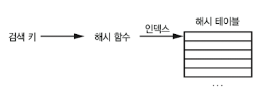
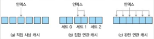
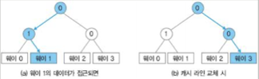
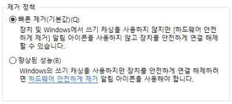
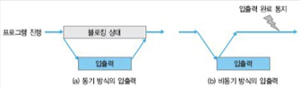
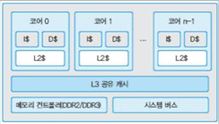

# 12 캐시

cache는 pipeline과 함께 processor performance를 높인 일등 공신이다. cache는 자주 쓰고 인접한 data를 저장하는 것으로, main memory인 DRAM에서 data를 불러오는 시간의 낭비를 줄일 수 있다.

> 현대 범용 목적의 microprocessor 사진을 보면 cache가 거의 절반 이상의 공간을 차지하고 있다. 이런 cache를 **on-chip**라고도 지칭한다.

아래 사진은 nehalem architecture의 칩 구조이다.


- 아래 Shared L3 cache가 위치하고, 각 core의 절반 정도가 L1, L2 cache에 해당된다.

- 가장 자리에는 memory 및 IO controller가 있다.

> 주로 마지막 level의 chip 내 cache를 **LLC**(Last Level Cache)라고도 부른다. LLC 이후로는 chip 밖의 memory hierarchy로 이동해야 한다.

---

## 12.1 cache의 필요성

DRAM에서 data를 요청하고 받아오는 데는 보통 100 cycle 이상, 많게는 수백 cycle도 걸린다. 하지만 cache에 저장한 data는 1~2 cycle이면 register file에서 가져올 수 있다. 게다가 processor의 clock 속도가 main memory의 clock 속도보다 훨씬 빠르기 때문에 문제가 더 심각하다.

cache가 CPU에만 위치하지는 않는다. 일반적으로 memory hierarchy에서 속도나 공간, 가격 차이가 있는 계층 사이라면 cache가 존재할 수 있다. 

> 예를 들면 hard disk에도 cache가 있다. DRAM 내에는 row buffer(행 버퍼)가 있다. software까지 생각하면 더 많아진다. OS의 file system에도 여러 buffer와 cache가 있다. server system에도 다양한 계층의 cache를 두어 응답 속도를 높인다.

cache는 data 사용에 있어 **locality**(지역성)을 이용한 장치다. locality는 **temporal** locality와 **spatial** locality로 나뉜다.

- temporal locality: 지금 사용한 어떤 data가 가까운 미래에 다시 사용될 가능성이 높다.(cache가 최근 쓴 data를 보관하게 된다.)

- spatial locality: 어떤 data와 인접한 data가 사용될 가능성이 높다.(cache가 인접한 data도 가져오게 된다.)

대부분의 data access는 random하지 않고 locality를 갖는다. 예를 들어 다음 for loop를 보자.

```c
for (int i = 1; i < N; ++i) {
    data[i] = data[i - 1] + 1;
}
```

- 예를 들어 data[1]이 계산되면, 다음 iteration에서 operand로 읽힌다. 이는 temporal locality이다.

- data[1]부터 data[N-1]은 서로 인접하므로 spatial locality를 갖는다.

---

## 12.2 일반적인 software cache 구조

잠시 software cache를 살펴보자. cache module을 만들다고 할 때 필요할 interface는 다음과 같은 것들이 있다.

- cache에서 원하는 data를 찾는 function

- cache에 새 data를 추가하는 function.

  - cache는 공간이 제한적이므로, 꽉 찼을 때 새 data를 추가하는 경우도 생각해야 한다.

- 이전 data 일부를 교체할 수 있는 algorithm

cache에서 data를 찾을 때 다음과 같이 경우가 나뉘게 된다. cache에 원하는 data가 있을 때를 **cache hit**라고 말하며, 찾지 못했을 때를 **cache miss**라고 한다. 

> 대부분의 요청에서 cache miss가 나면 cache를 사용하지 않는 것이 더 낫겠지만, 대체로 적중 실패는 10% 안쪽이기 때문에 performance를 크게 향상시킬 수 있다. 이런 특징 때문에 도박의 원리가 적용된 장치로 보기도 한다.

만약 cache miss가 있다면 직접 해당 data를 찾아와야 하며 이렇게 생기는 cost를 **miss penalty**라고 한다. 반면 cache hit에서도 cost는 발생하는데, 이를 **hit latency**라고 한다.

아래 그림은 일반적인 software 기반 cache system 구조이다. 


- cache system은 여러 **cache entry**로 구성된다. 

  >cache entry란 cache memory 속 data를 구분하는 논리적인 최소 단위를 의미한다.

- 각 entry는 실제 cache하는 data와 부가 정보로 구성된다.

- 부가 정보는 구현에 따라 다르지만 일반적으로는 다음과 같은 정보가 필요하다.

  - 실제 저장되는 data

  - tag

  - cache 탐색을 위한 정보(pointer 등)

  - cache 교체를 위한 정보(언제 얼마나 이용되었는지 등)

  - 기타 정보

cache에서 특정 data를 찾는 작업은 일반적으로 **hash table** data structure로 구현된다. cache entry의 수가 저장할 수 있는 전체 data 수보다 훨씬 작기 때문에 제일 합리적인 구조이다. 



-  hash table이란 hash function의 결과를 array index로 사용하는 방법을 의미한다.(array의 각 element를 bucket이라고 한다) 

- hash function은 계산하기 쉬워야 하며 key를 골고루 bucket에 뿌려줘야 한다.

> 하지만 hash function의 값이 겹치는 경우가 생길 수 있다. 이를 **collision**(충돌)이라고 한다. **hash chain**을 사용해 이런 문제를 해결할 수 있다.

cache가 가득찼다면 기존의 cache entry 중 일부를 교체하는 algorithm이 필요하다.(예를 들어 가장 오랫동안 쓰이지 않은 cache entry를 삭제하고 그 자리를 차지하는 algorithm을 쓸 수 있다.) replacement policy에 따라 단순히 counter만 필요할 수도 있고, 다양하고 복잡한 data structure가 필요할 수도 있다. 

> 따라서 cache 설계에서 cache entry 구조를 정하고, 최적의 탐색 방법과 replacement policy를 정의해야 한다.

CPU cache, 혹은 hardware cache도 기본적인 개념은 software cache와 동일하다. 그러나 CPU cache는 대부분 **SRAM**(Static Random Access Memory)로 만들어지기 때문에 가격이 비싸며 공간은 한정되어 있다. 또한 CPU cache에서 hash table처럼 pointer로 연결된 data structure를 순회하거나 갱신하기는 어렵다.(탐색에서 복잡한 hash function을 쓰기도 어렵다.)

> cache replacement에 필요한 부가 정보도 그 양을 줄여 bit 단위로 관리한다. replacement algorithm도 최대한 간단히 만들어야 한다. 그렇지 않으면 cache latency가 지나치게 길어지게 된다.

---

## 12.3 CPU cache의 기본적인 설계

CPU cache는 locality를 활용했다. 그런데 cache는 프로그래머 입장에서는 **transparent**(투명)하게, 즉 cache가 있는지 없는지 모르게 처리되므로, 프로그래머는 특별한 optimization이 아닌 이상 cache를 고려할 필요가 없다.

cache는 여러 계층으로 구성되어 있다. processor가 memory system에 data를 요청하면 L1 cache에서 먼저 찾는다. 여기서 못 찾으면 그 아래 memory hierarchy인 L2 cache에서 찾는다. 이후 LLC까지 도달해도 없다면 비로소 main memory로 가서 data를 가져온다. 이 data는 cache에 보관되고 최종적으로 processor에 반환된다.

일반적으로 L1 cache는 효율성을 이유로 instruction과 data를 분리해서 저장한다. 하지만 L2 cache 이상은 보통 data와 code를 분리하지 않고 한꺼번에 저장한다.

> DRAM에서 가져온 data에서 instruction은 읽기만 하지만, data는 읽기와 쓰기를 동시에 하기 때문이다. L1 cache memory 내 각각 instruction cache, data cache에 저장된다.

> 이런 특성 때문에 instruction은 spatial locality가 높고, data는 보통 temporal locality가 높다.

앞서 본 cache entry에 대응되는 개념인 **cache line**(혹은 **cache block**)을 살펴보자. 이 cache line에 저장되는 data의 단위 size는 (**spatial locality**를 활용하기 위해 1 byte나 4 byte가 아닌 그보다 큰) 32, 64, 128byte가 일반적이다.


> 대부분 단위를 64byte로 갖는다. cache line 크기가 너무 작으면 spatial locality 활용이 적어진다. 하지만 너무 크면 그만큼 data를 가져오는 데 시간이 더 걸리게 된다.(주변 회로도 더 복잡해진다.)

> 이처럼 spatial locality를 이용해서 cache hit ratio를 높이게 된다. cache entry와 마찬가지로 tag나 부가 정보가 덧붙는다.


cache 설계는 다음 네 가지 문제를 풀어야 한다.

- 검색 방법: 주어진 data가 cache에 있는지 어떻게 알아낼 수 있는가?

- 배치 정책: 주어진 data가 cache 어디에 자리 잡을 것인가?

- 교체 정책: cache에 빈 공간을 어떻게 마련할까?

- 쓰기 정책: data를 쓰는 작업은 어떻게 다룰 것인가?

---

## 12.3.1 cache lookup policy

data address 값이 주어졌을 때 이에 해당되는 cache line을 어떻게 찾을 수 있을까? 예를 들어 32bit processor에서 64byte cache line을 사용한다고 하자. 임의의 address 값이 넘어오면 가능한 6천만 개( $2^{32} / 2^{6} = 2^{26}$ )의 가능한 cache line 중 하나가 선택되게 된다. 

> 32bit processor는 register의 크기가 32bit라는 뜻이었다. 32bit는 $2^{32}$ 개의 숫자를 표현할 수 있으며, 즉 이는 $2^{32}$ 개의 memory address를 저장할 수 있다는 뜻이다.

하지만 cache의 크기는 L1 cache가 고작 32KB 정도, 이보다 큰 L2/L3 cache도 MB 단위이다. 따라서 사실 저장할 수 있는 cache line 수는 수백~수만 개밖에 안 된다.

따라서 6천만 개의 cache line address를 mapping할 수 있어야 한다. 이를 위해서는 이상적으로는 hash table 같은 data structure가 필요하지만 여러 제한으로 인해 구현이 불가능하다. 

이 대신 단순한 cache line의 array로 구성된다.(또한 hardware에서는 software에서의 복잡한 hash function을 만들기에는 너무 비용이 많이 든다.) 간단하게 주어진 address를 단순 분해해서 cache data structure로 mapping이 이루어진다.

cache memory는 다음과 같이 구성된다.


- cache memory는 S개의 집합으로 이루어져 있고, 각 집합은 E개의 cache line을 갖는다.

- set당 cache line 수(E)가 1이면 **direct-mapped cache**, 1보다 크면 **E-way set associative cache**라고 한다.

다음은 cache line을 구성하는 요소다.

- valid bit: cache line이 유효한지 알려준다.(최상위 1bit)

- index

  

  예를 들어 512개의 cache line이 있는 cache라면, 가운데 9bit( $2^{9} = 512$ )만큼이 index에 해당된다. 

- tag

  그리고 최상위 bit 중 나머지 부분이 tag이다. tag는 index로 찾아낸 cache line이 내가 정말 원하는 값인지 확인하는 데 쓰인다. 수많은 address가 같은 index를 가질 것이므로 꼭 필요한 작업이다.

- offset

   마지막으로 하위 bit 일부는 offset으로 쓰인다. offset은 cache line 내에서 원하는 data를 가리키는 데 필요하다. 예를 들어 64 byte cache line이라면 6bit( $2^{6} = 64$ )만큼이 offset 영역이 된다.(즉, 0~63의 숫자로 64개 byte data 중 하나를 고르게 된다.)

> index와 offset을 실질적인 data가 들어있다고 해서 cache block으로 묶어서 부르기도 한다.

> valid bit와 tag를 제외하고, cache block의 size만 따져서 cache memory의 총 size를 구한다.(S\*E\*B)

index를 가운데 영역으로, tag를 최상위 영역으로 지정한 이유는 cache mapping 시 충돌을 적게 하기 위함이다. 만약 index가 최상위에 위치하고 tag가 중간에 위치한다면, 인접한 data에 access할 때 최상위 부근의 숫자는 거의 바뀌지 않을 것이다. 이는 탐색에서 cache의 성능 저하를 일으킨다.

구성 요소의 size를 계산해 보자. 예를 들어 32bit processor에서 64( $2^{6}$ )byte cache line을 갖는 32KB( $32* 2^{10}$ ) cache 구조가 있다고 하자. 

- 32KB cache는 총 $2^{9}$ 개( $32 * 2^{10}/2^{6} = 512$ )의 line을 저장할 수 있다. 

- offset은 6bit, index는 9bit, tag는 15bit(32-6-9)가 된다. 

시뮬레이터를 만들면 다음과 같다. 또한 cache line마다 현재 line이 유효한지를 가리키는 (1bit 크기의) valid bit가 구현되어 있다.

```cpp
// 32bit address space, 64byte cache line, 32KB cache
struct Data {
  byte element[64];
};

struct CacheLine {
  bool     valid;   // valid bit(1bit)
  uint32_t tag;     // tag(15bit)
  Data     data;    // data(64byte)
};

// 32KB cache data structure
CacheLine cache_[512];

// 주어진 address 값에 해당하는 cache line을 읽어온다.
CacheLine& LookupCache(uint32_t addr)
{
  //addr에 해당되는 index를 구한다. 가운데 9bit만 추려낸다.
  uint32_t index = (addr >> 6) & 0x1FF;
  uint32_t tag   = (addr >> (6 + 9));
  
  // valid가 켜져 있고 tag가 같아야 원하는 address이다.
  if (cache_[index].vaild == true && cache_[index].tag == tag) {
    return cache_[index];
  }
  else {
    return invalid_cache_line;
  }
}
```

---

### 12.3.2 cache placement policy

주어진 address를 cache를 저장할 때 문제가 더 남아있다. 앞서 cache index 값을 구해서 바로 그 자리에 data를 저장했다. 그런데 같은 index를 가지는 memory address는 오직 한 곳에 배치되야 하지만, cache와 같은 구조라면 여러 memory address가 collision이 일어날 수 있다.

예를 들어 0xA00과 0xB00의 data가 모두 같은 cache index를 가지고, 두 address가 번갈아가며 access된다고 하자. 이런 상황에서는 두 address에 access할 때마다 cache miss가 일어난다. 이러한 confilct(충돌)를 최소화하고자 하나의 index 안에 여러 개의 cache 공간을 할당한다.

cache placement policy(캐시 배치 정책)으로는 세 가지 종류가 있다.



- **direct-mapped** cache(직접 사상 캐시)

- **set-associative** cache(집합 연관 캐시)

- **fully-associated** cache(완전 연관 캐시)

set-associative cache는 index 하나에 cache line이 N개씩 들어갈 수 있는데, 이를 N-way set-associative cache라고 한다.(예시 그림은 2-way) N을 **associativity**(연관도)라고 하며, cache line N개가 하나의 set를 이루게 된다.

> 앞서 예시로 든 0xA00, 0xB00만 해도 2-way만 되면 cache collision miss를 없앨 수 있다. 이처럼 set-associative는 cahce collision을 줄일 수 있다는 장점을 가진다.

> N-way set-associative cache는 각 element마다 N개의 고정 길이를 가진 hash table처럼 볼 수 있다.

아래는 4-way set-associative cache를 구현한 code 예시다.

> 예시에서 for iteration으로 표기했지만 실제로는 작업이 동시에 수행된다. 하지만 그만큼 전력과 트랜지스터 비용이 더 소모된다. associativity를 늘리면 cache collision은 줄어드나 그만큼의 cost가 들기 때문에 적절한 균형을 찾아야 한다.

```c
// 32bit address space, 64byte cache line, 32KB cache (4-way set-associative)
// Cache Line 구조는 동일
struct CacheSet
{
  CacheLine line[4];
};

// 32KB 4-way cache data structure
// direct-mapped는 512개의 set가 있었다. 4-way이므로 128 = 512/4
// index bit도 9bit에서 7bit로 줄어들게 된다.(2^7 = 128)
CacheSet set_[128];

CacheLine& LookupCache(unit32_t addr)
{
  // addr에 해당되는 set index를 구한다.(가운데 7bit만 추려낸다.)
  unit32_t set_index = (addr >> 6) & 0x07F
  unit32_t tag       = (addr >> (6 + 7));

  // set의 모든 cache line과 비교한다.
  CacheSet& set = set_[set_index];
  for (int i = 0; i < 4; ++i) {
    if (set.line[i].valid && set.line[i].tag == tag) {
      return set.line[i];
    }
  }

  return invalid_cache_line;
}
```

---

## 12.3.3 cache replacement policy

같은 cache size에서는 hit rate(적중률)도 cache associativity에 영향을 미치지만, cache replacement policy(캐시 교체 정책)이 상당히 중요한 역할을 한다. 

direct-mapped cache는 index가 갈 수 있는 곳이 하나뿐이라서, 이미 어떤 data가 그 자리를 차지하고 있다면 그 data를 삭제하고 대체한다. 따라서 cache replacement policy를 고려할 필요가 없다.

하지만 set-associative cache는 빈 공간이 없다면 최대 N개 중 하나를 골라 없애야 하므로 cache replacement policy가 중요해진다.(단순히 random으로 아무 cache line이나 쫓아낸다면 성능이 좋게 나올 수 없다.)

ideal policy는 '앞으로' 가장 오랫동안 사용하지 않을 cache line을 내보내는 것이다. 하지만 이를 완벽하게 알 수는 없고, 과거의 정보를 이용해서 추론할 수만 있다.

- **LRU**(Least Recently Used): 가장 최근까지 사용되지 않은 cache line을 제거한다. 제일 일반적으로 사용한다.

- **LFU**(Least Frequently Used): cache line의 access 빈도를 따진다.

- **FIFO**(First In First Out)

사실 software적인 구현 방법은 매우 직관적이다. LRU는 cache line마다 **time stamp**, 즉 마지막으로 접근한 시각을 기록한다. LFU는 access마다 counter 값을 증가시키고, FIFO는 queue를 쓰면 된다.

> time stamp는 CPU cycle 값을 이용해서 기록한다.

하지만 hardware에서 이러한 구현 방식은 실현되기 어렵다. CPU cycle을 사용하면 금방 조 단위로 증가하게 되므로 32bit보다 큰 integer가 필요하게 된다. 따라서 이런 counter는 무지막지한 비용을 잡아먹게 될 것이다.

따라서 다음 algorithm을 사용해서 LRU를 구현한다. N-way set-associate cache라면 cache line마다 $\log{2N}$ bit counter만 있으면 LRU를 구현할 수 있다.

1. 0 ~ N-1까지의 범위가 가능한 counter를 할당한다.(예를 들어 16-way라는 4bit(2^4) counter를 둔다.)

2. cache line이 access되면 cache line의 counter가 가지고 있던 값 $t$ 를 잠시 기록하고, 이 counter의 값을 최대값 N-1로 바꾼다. 그리고 같은 set에 있는 다른 cache line 중 counter 값이 $t$ 보다 크면 1씩 감소시킨다.

3. (set 내 빈 cache line이 없어서) replacement가 필요할 때, counter가 0인 cache line을 찾아서 삭제한다. 

그러나 최근 cache, 특히 size가 크고 여러 core들이 공유하는 L3 cache는 16-way, 24-way를 넘기기도 한다. N-way가 클수록 hardware cache에서 LRU를 구현하려면 counter가 더 많은 bit가 필요하고, counter를 서로 비교하고 갱신하는 비용이 커서 부담이 된다. 따라서 LRU algorithm을 그대로 사용하지 않고 **pseudo** LRU algorithm을 쓴다.

pseudo LRU는 cache set에 있는 cache line을 마치 tree structure로 관리하는데, 가장 최근에 access한(Most Recently Used(**MRU**)) cache line으로 가는 경로를 기록하게 된다.



- cache에 access할 때 bit 값 0은 왼쪽으로, 1은 오른쪽으로 간다는 의미다.

- (a): way 1에 있는 cache에 access됐을 때, LRU bit가 갱신되는 모습

  - cache line이 replacement될 때는 이와 반대로 해석해서 이동하게 된다.

- (b): (a)를 반대로 해석해서 cache replacement를 수행한다.

위는 pseudo LRU의 작동 예시 그림이다. 비록 완벽하지는 않지만 적어도 MRU인 way 1은 결코 선택되지 않는다. 

L1 cache에서는 LRU나 pseudo LRU가 보통 좋은 성능을 낸다. 그러나 L2, L3은 다른 policy를 쓰기도 한다. 기본적으로 L2 cache의 access 형태가 L1 cache miss의 결과임을 생각해 보자. L1 cache는 보통 LRU를 채택하므로 MRU cache line이 최대한 보존되지만, 다른 level의 cache로 접근하게 되면 temporal locality가 낮아지게 된다. 

---

### 12.3.4 cache write policy

cache write에서는 두 가지 policy를 생각해 볼 수 있다.

- **write-through**: memory 또는 아래 level cache에 바로 반영하기

- **write-back**: 변경된 data를 일단 cache가 들고 있다가, 나중에 cache에서 쫓겨날 때 비로소 memory를 갱신하기

write-through policy는 매번 memory나 아래 level cache에 반영하기 때문에 latency가 길다. 따라서 당연히 write-back policy가 훨씬 좋아 보이지만 이 방식은 구현이 조금 복잡하다.

write-back은 cache line마다 **dirty bit**를 둔다. 처음 이 값은 0에서 시작해서, 이후 cache line이 쓰이게 되면 dirty bit를 켠다. 이는 갱신된 data가 cache line에만 있고, 아직 memory에 최종 반영되지 않았음을 의미한다. 이후 cache line이 replace될 때 비로소 memory에 갱신된 값으로 쓰게 된다.

일반적으로 대부분의 cache은 write-back policy를 사용하지만, 예외적으로 L1 instruction cache는 흔히 write-through policy를 쓴다. program instruction code에서는 보통 갱신이 일어나지 않기 때문이다.

> 이런 cache write policy는 file IO programming에서도 쉽게 찾아볼 수 있다. 다음 사진은 windows OS에서 disk drive의 cache write policy를 설정하는 창이다.



일반적인 hard disk는 write back policy로 설정되어 있다. 따라서 hard disk에 data를 바로 쓰지 않고 일단 cache에서 data를 갱신하게 된다. 그리고 cache가 다 차면 주기적으로 이 data를 memory로 내보낸다.

> 하지만 이런 방식은 USB처럼 빈번히 탈착되는 저장 장치에는 악영향을 미칠 수 있다. USB를 제거하기 전에 아직 반영하지 못한 data를 처리해야 한다. 따라서 write-back policy 기능을 킨 상태라면 반드시 '하드웨어 안전하게 제거'를 거쳐야 한다.

---

## 12.4 high performance cache를 위한 algorithm

cache performance는 다음과 같이 정량적으로 표기할 수 있다. 일반적인 cache performance는 average memory access time(평균 메모리 접근 시간)을 이용해 나타낸다.

- average memory access time = hit latency + miss rate * miss penalty

  - miss rate = cache miss/(cache miss + cache hit)

average memory access time을 줄이기 위한 세 항은 서로 연관되어 있다. 예를 들어 cache size를 늘리면 당연히 cache miss(miss rate)는 줄어든다. 하지만 cache에서 data를 가져오는 데 드는 시간인 hit latency는 악화된다. 따라서 cache miss를 무작정 크게할 수도 없다.

---

### 12.4.1 cache inclusion policy

거의 대부분의 cache는 L1, L2, L3처럼 hierarchy를 이루고 있다. 이렇게 memory latency를 줄일 수 있지만 cache hit 때 data를 가져오는 cost는 커지게 된다. 예를 들어, 64KB cache에서 data를 읽어올 때 3cycle이 걸린다고 하자. 8KB cache는 이것을 1cycle에 처리할 수도 있다. 이처럼 size가 큰 cache는 cache miss는 적겠지만, 전체적인 average memory access time은 오히려 손해를 볼 수 있다.

다음 예시는 몇몇 CPU의 cache 용량을 나타낸 표이다.

| Intel Core i9-13900K | AMD Ryzen 9 7950X | Intel Core i9-12900KF | AMD Ryzen 7 7700X | AMD Ryzen 5 7600X | 
| :---: | :---: | :---: | :---: | :---: | 
| L1 Cache | 2.1MB | 1MB | 1.4MB | 512KB | 384KB |
| L2 Cache | 32MB | 16MB | 14MB | 8MB | 6MB |
| L3 Cache | 36MB | 64MB | 30MB | 32MB | 32MB |

또한 hierarchy를 구성하게 되면 data 보관으로도 생각해야 할 문제가 생긴다. 대표적으로 세 가지 cache inclusion policy가 있다. 

- **inclusive policy**: 어떤 cache line이 L1에 있을 때, 반드시 L2에도 있을 것을 보장한다.

  - 단순히 존재 여부만이 아니라 cache line이 가지고 있는 값도 모든 cache level이 같은 값을 갖는다.

  - 따라서 cache miss가 일어나면 다른 cache level에서 탐색한다. 즉 **miss latency**가 낮다.

  - 하지만 low level cache가 다른 level의 cache memory capacity를 제한해 버리는 단점이 있다.(higher level cache capacity가 낭비된다.)

- **exclusive policy**: 어떤 cache line이 L1에 있다면, L2에는 반드시 없다.

  - 따라서 제일 많은 memory capacity를 활용할 수 있게 된다.

- **NINE policy**: non-inclusive non-exclusive. 어떤 cache data가 L1에 있다면, L2에는 있을 수도, 없을 수도 있다.

---

### 12.4.2 cache miss의 분류와 줄이는 방법

cache miss가 어떤 이유로 발생하는지, 그리고 어떻게 줄일 수 있는지 알아보자.

- **cold miss**: compulsory miss라고도 한다. data를 최초로 읽을 때 발생한다.

  - cache line 크기를 늘리거나 prefetching으로 줄일 수 있다.

  > 그러나 전체 capacity가 같은 구조에서 cache line만 지나치게 커지면, 다른 conflict miss나 capacity miss가 발생할 가능성이 커진다.

- **conflict miss**: cache의 associativity가 부족해서 발생한다.

  - cache associativity를 높이면 되지만, 너무 크면 hit latency가 악화될 수 있다.

  > N-way라면 모든 way가 주어진 data와 tag가 서로 일치하는지 확인해야 한다.

- **capacity miss**: cache의 capacity가 부족해서 발생한다.

  - cache size를 늘리는 방법 말고는 없다. 이때 cache가 커지면서 hit latency가 악화될 수 있다.

- **coherence miss**: 다른 processor에 의해 cache line이 무효화되어 발생한다.

  - multicore에서는 cache가 여러 군데 있어서, cache에 저장된 data 사이에 **coherence**(일관성)을 유지하기 어렵다.

참고로 conflict miss를 줄이는 아주 간단한 기법이 있다. 바로 **victim cache**라는 아주 작은 규모의 fully associative cache를 두는 것이다. 이 작은 buffer는 cache replacement로 쫓겨난 몇몇 cache line을 보관하는 역할을 맡는다.

즉, 이런 특성상 data가 L1에서 밖으로 throw out될 때, victim cache에 해당 data가 채워지게 된다. 그리고 L1 cache에서 cache miss가 발생했을 때, victim cache를 살펴보고 만약 access 결과가 hit라면 L1 cache line과 victim cache line의 data가 서로 swap된다.

> 처음에는 L1 cache의 cache miss를 보완하기 위해 제안되었지만, 현재는 L3 cache에서도 victim cache를 도입했다.(L4 cache로 지칭하기도 한다.)

---

### 12.4.3 기타 방법

보통 file 혹은 network I/O program을 만들 때, synchronize(또는 blocking) 방식 또는 asynchronize 방식을 사용한다.



예를 들어 긴 시간이 걸리는 파일 쓰기 작업이 있다고 하자.

- synchronize: 파일 쓰기를 요청한 뒤 완료될 때까지 block한다. 다른 task를 수행할 수 없다.

- asynchronize: 파일 쓰기 작업을 요청만 하고, 원래 program은 다른 일을 한다. 그리고 파일 쓰기 작업이 끝났을 때 system은 완료 신호를 program에 보낸다.(이러한 기법을 **latency hiding**이라고 부른다.)

> 현재는 non-blocking cache를 사용한다. 물론 동시에 처리할 수 있는 cahce miss의 개수는 hardware의 제약을 받는다.

cache 역시 pipelining이 가능하다. 앞서 pipeline은 latency를 줄이지는 못하고 throughput을 개선하는 기술이었다. cache을 pipeline으로 만들면 매 cycle마다 cache에 data access를 요청할 수 있다.(특히 L1 cache에 필수적이다.)

이외 **prefetcher**와 같은 hardware 및 software 기술로 cache miss penalty 또는 cold miss를 줄일 수 있다. 특히 matrix access처럼 data 사용 예측이 쉬울 때 특히 효과가 크다.(ch16 참조)

---

## 12.5 multicore에서의 cache

multicore에서 cache는 각 core가 쓰는 **private cache**(전용 캐시)와 여러 core가 공유하는 **shared cache**(공유 캐시)가 있다. 

아래는 2010년 AMD(Phenom)/Intel(Nehalem)의 cahce 구조를 나타낸 그림이다.



- \$는 cache로 읽는다.

- 각 core에는 instruction/data L1 cache가 private cache로 들어 있다. L2 cache 역시 private cache로 들어 있다.

- L3 cache는 모든 core가 공유할 수 있는 shared cache이다.

multicore는 cache가 여러 군데 있어서 data 사이의 일관성을 유지하기 어렵다. 이를 **coherence** problem이라고 한다.

cache coherence를 지원해야 하는 간단한 예시를 보자. 

1. 위 그림에서 core 0이 address 100에 해당되는 data를 읽는다.

    - address 100의 data가 core 0의 private cache에 있게 된다.

2. core 1도 address 100에 해당되는 data를 읽는다.

    - address 100의 data가 core 1의 private cache에 있게 된다.

3. 이때 만약 core 0이 address 100에 새로운 값을 쓴다면, 대부분의 cache(instruction L1 cache 제외)는 write-back policy이므로 바로 memory에 갱신되지 않고, core 0의 private cache에만 갱신될 것이다.

4. core 1이 다시 address 100 data를 읽어온다면 갱신된 내용이 아닌 예전 값을 읽게 된다.

이런 문제를 프로그래머가 일일이 고민할 수는 없다. 따라서 hardware가 cache coherence를 지원해야 한다. 이런 coherence problem은 multicore만이 아니라, data 사본이 있을 수 있는 모든 memory system에서 발생할 수 있다.

> 예를 들어 web server cache도 동일한 page가 여러 군데 저장될 수 있는데, 어느 한쪽만 갱신되는 식으로 coherence problem이 발생할 수 있다.

---

### 12.5.1 MSI snooping protocol

cache coherence의 대표적인 예로 **MSI snooping protocol**이 있다. cache line마다 세 가지 coherence 상태인 **M**(modified), **S**(Shared), **I**(Invalid)를 가진다. 그리고 cache access마다 bus를 통해 모든 cache에게 신호를 보내는 snooping 작업을 진행한다.

> snoop은 '기웃거리다, 염탐하다'라는 뜻을 가지고 있다.

- Invalid: 어떤 cache line의 상태가 유효하지 않다. 즉, read/write를 위해 반드시 값을 요청해야 한다.

- Shared: cache line이 **dirty**하지 않다. 즉, write된 적이 없고 오직 read만 이루어진 상태다. memory도 cache line의 최신 값과 일치한다.

  - cache line은 자기 자신만 들고 있을 수도 있고, 한 곳 이상에서 공유하고 있을 수 있다.

  - 여기서 어떤 processor가 write 작업을 수행하려면, 반드시 신호를 보내 <U>자신의 cache line을 M 상태로 바꾸면서 다른 cache 사본은 I 상태로</U> 바꿔야 한다.

- Modified: cache line이 어떤 한 processor에 의해 고쳐졌음(dirty)를 의미한다. memory에도 이 값이 반영되지 않았을 수도 있다.

  - cache line이 M 상태라면 오직 하나의 core만 이 cache line을 가지고 있다.

  - 같은 cache line이 공유될 때는, read는 괜찮으나 write는 오직 하나의 processor만 그 사본을 가질 수 있다.

다음 예시를 보자. memory address X에 대한 작업이 P1, P2, P3에서 이루어진다. initial state에서는 모든 processor가 이 data를 가지고 있지 않다. 목표(cache coherence)는 P1, P2, P3가 X 값을 읽을 때, 항상 갱신된 최신 값을 읽을 수 있도록 하는 것이다.

```
P1: Read  X
P1: Write X
P3: Read  X
P3: Write X
P1: Read  X
P3: Read  X
P2: Read  X
```

1. P1이 X를 read한다. 아직 cache line에 없으므로 cache miss이다.

    - data를 읽겠다는 snooping 신호를 bus로 보낸다. 이 data를 달리 들고 있는 processor가 없으므로 그냥 memory에서 이 값을 읽어온다.

    - cache line은 S 상태가 된다.

2. P1에 X에 write한다.

    - cache line은 M 상태로 갱신된다. 동시에 이 cache line을 invalid로 바꾸라는 신호를 bus로 보낸다.(달리 갖고 있는 processor가 없으니 바뀌는 건 없다.)

    - dirty 상태가 된다. cache line에서 이 data가 쫓겨난다면 반드시 memory에 반영해야 한다.

3. P3이 X를 read한다.

    - memory는 갱신 이전 값을 가지고 있으므로, P3의 요청에는 절대 응답하지 않는다.

    - P1이 bus를 통해 이 신호를 듣고 (dirty한) 최신 값을 전송해 주겠다는 신호를 보낸다.

    - P1이 cache line 내용을 bus로 보낼 때, memory에 해당 값의 갱신과 P3으로 보내는 과정이 함께 진행된다.

    - 이제 P1은 S 상태, P3도 S 상태이다.

4. P3이 X를 write한다.

    - P3은 S 상태에서 M 상태가 된다.

    - P1은 P3에서 보낸 신호를 받아 cache line을 invalid한다.

5. P1이 X를 read한다.

    - 그런데 P1 cache line이 P3에 의해 invalid가 되었으므로 cache miss가 발생한다.(이것이 coherence miss이다.)

    - 3번 과정과 비슷하게 진행된다. P1은 S 상태, P3도 S 상태가 된다.

6. P3이 X를 read한다.

    - S 상태이고 read 작업이라 bus로 신호를 보낼 필요가 없다. 바로 data를 읽는다.

7. P2가 X를 read한다. 처음이므로 cache miss이다.

    - memory 혹은 P1이나 P3에서 X 값을 전송해 준다.

    > 이처럼 cache가 memory가 아닌 다른 core의 cache에서 data를 전달 받는 것을 **cache-to-cache transfer**라고 한다.

이러한 cache coherence는 **scalability**(확장성)과 직결된다. core가 계속해서 늘어났을 때도 이러한 protocol이 잘 작동해야만 scalability를 가질 수 있게 된다.

---

### 12.5.2 MESI protocol

MSI protocol은 정확한 cache coherence를 보장하지만, 신호를 보내는 작업이나 memory access 횟수가 많다. processor 개수가 많아지면 이런 bus snooping 트래픽도 같이 증가하여 bottleneck 지점이 된다. 특히 낭비되는 지점은 아무도 data를 공유하지 않을 때도 bus 트래픽이 낭비되는 부분이다.

MESI protocol은 MSI에서 **E**(Exclusive) 상태를 추가한다. E는 오직 혼자만이 dirty하지 않은(= memory와 같은) data를 가지고 있는 상태를 뜻한다. 

앞서 MSI 예시에서 이를 적용하면, 1번: P1이 X를 read할 때 S 상태가 아닌 E 상태로 바뀌게 된다. 따라서 2번: P1이 X에 write할 때, bus에 신호를 보내는 낭비를 막을 수 있다.

> 이런 MESI도 완벽하지 않다. 여러 processor가 빈번히 공유 data를 쓴다면 매번 dirty cache line이 memory로 반영되는 부담이 있다. 따라서 dirty cache line도 공유할 수 있게 허용한 MOESI(O: Owner) protocol도 있다.

> MOESI protocol에서는 한 processor를 owner(책임자)로 할당한다. 그리고 이 Owner 상태를 가진 processor가 최종적으로 writeback을 하게 된다.

---