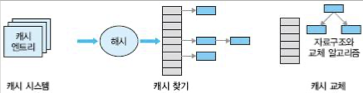
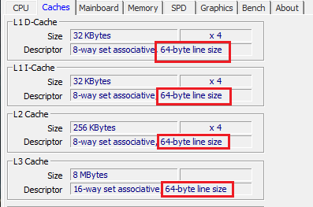
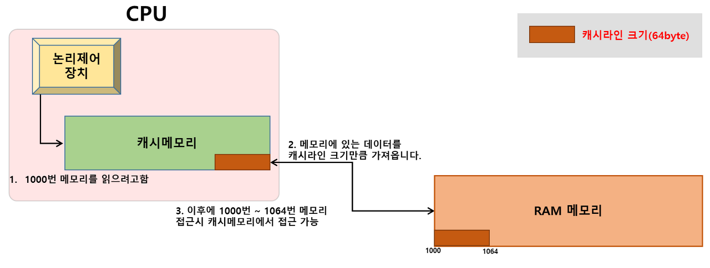
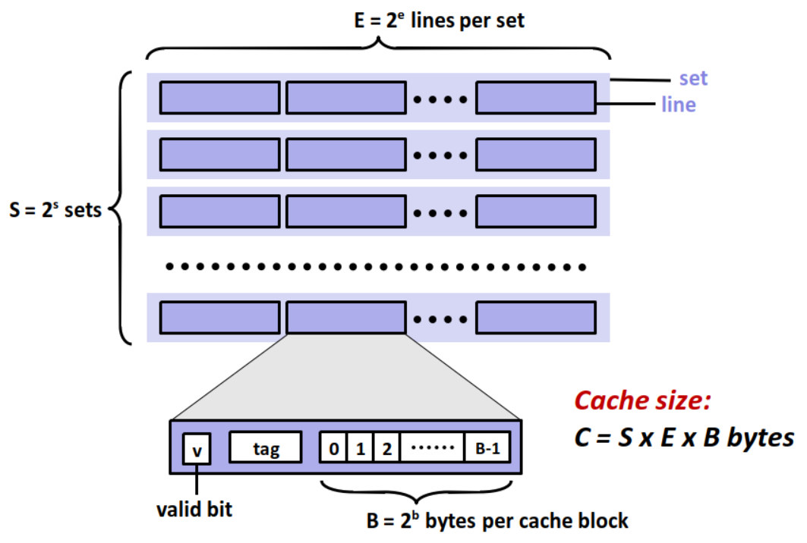

# 12 캐시

cache는 pipeline과 함께 processor performance를 높인 일등 공신이다. cache는 자주 쓰고 인접한 data를 저장하는 것으로, main memory인 DRAM에서 data를 불러오는 시간의 낭비를 줄일 수 있다.

> 현대 범용 목적의 microprocessor 사진을 보면 cache가 거의 절반 이상의 공간을 차지하고 있다. 이런 cache를 **on-chip**라고도 지칭한다.

아래 사진은 nehalem architecture의 칩 구조이다.


- 아래 Shared L3 cache가 위치하고, 각 core의 절반 정도가 L1, L2 cache에 해당된다.

- 가장 자리에는 memory 및 IO controller가 있다.

> 주로 마지막 level의 chip 내 cache를 **LLC**(Last Level Cache)라고도 부른다. LLC 이후로는 chip 밖의 memory hierarchy로 이동해야 한다.

---

## 12.1 cache의 필요성

DRAM에서 data를 요청하고 받아오는 데는 보통 100 cycle 이상, 많게는 수백 cycle도 걸린다. 하지만 cache에 저장한 data는 1~2 cycle이면 register file에서 가져올 수 있다. 게다가 processor의 clock 속도가 main memory의 clock 속도보다 훨씬 빠르기 때문에 문제가 더 심각하다.

cache가 CPU에만 위치하지는 않는다. 일반적으로 memory hierarchy에서 속도나 공간, 가격 차이가 있는 계층 사이라면 cache가 존재할 수 있다. 

> 예를 들면 hard disk에도 cache가 있다. DRAM 내에는 row buffer(행 버퍼)가 있다. software까지 생각하면 더 많아진다. OS의 file system에도 여러 buffer와 cache가 있다. server system에도 다양한 계층의 cache를 두어 응답 속도를 높인다.

cache는 data 사용에 있어 **locality**(지역성)을 이용한 장치다. locality는 **temporal** locality와 **spatial** locality로 나뉜다.

- temporal locality: 지금 사용한 어떤 data가 가까운 미래에 다시 사용될 가능성이 높다.(cache가 최근 쓴 data를 보관하게 된다.)

- spatial locality: 어떤 data와 인접한 data가 사용될 가능성이 높다.(cache가 인접한 data도 가져오게 된다.)

대부분의 data access는 random하지 않고 locality를 갖는다. 예를 들어 다음 for loop를 보자.

```c
for (int i = 1; i < N; ++i) {
    data[i] = data[i - 1] + 1;
}
```

- 예를 들어 data[1]이 계산되면, 다음 iteration에서 operand로 읽힌다. 이는 temporal locality이다.

- data[1]부터 data[N-1]은 서로 인접하므로 spatial locality를 갖는다.

---

## 12.2 일반적인 software cache 구조

잠시 software cache를 살펴보자. cache module을 만들다고 할 때 필요할 interface는 다음과 같은 것들이 있다.

- cache에서 원하는 data를 찾는 function

- cache에 새 data를 추가하는 function.

  - cache는 공간이 제한적이므로, 꽉 찼을 때 새 data를 추가하는 경우도 생각해야 한다.

- 이전 data 일부를 교체할 수 있는 algorithm

cache에서 data를 찾을 때 다음과 같이 경우가 나뉘게 된다. cache에 원하는 data가 있을 때를 **cache hit**라고 말하며, 찾지 못했을 때를 **cache miss**라고 한다. 

> 대부분의 요청에서 cache miss가 나면 cache를 사용하지 않는 것이 더 낫겠지만, 대체로 적중 실패는 10% 안쪽이기 때문에 performance를 크게 향상시킬 수 있다. 이런 특징 때문에 도박의 원리가 적용된 장치로 보기도 한다.

만약 cache miss가 있다면 직접 해당 data를 찾아와야 하며 이렇게 생기는 cost를 **miss penalty**라고 한다. 반면 cache hit에서도 cost는 발생하는데, 이를 **hit latency**라고 한다.

아래 그림은 일반적인 software 기반 cache system 구조이다. 



- cache system은 여러 **cache entry**로 구성된다. 

  >cache entry란 cache memory 속 data를 구분하는 논리적인 최소 단위를 의미한다.

- 각 entry는 실제 cache하는 data와 부가 정보로 구성된다.

- 부가 정보는 구현에 따라 다르지만 일반적으로는 다음과 같은 정보가 필요하다.

  - 실제 저장되는 data

  - tag

  - cache 탐색을 위한 정보(pointer 등)

  - cache 교체를 위한 정보(언제 얼마나 이용되었는지 등)

  - 기타 정보

cache에서 특정 data를 찾는 작업은 일반적으로 **hash table** data structure로 구현된다. cache entry의 수가 저장할 수 있는 전체 data 수보다 훨씬 작기 때문에 제일 합리적인 구조이다. 

cache가 가득찼다면 기존의 cache entry 중 일부를 교체하는 algorithm이 필요하다.(예를 들어 가장 오랫동안 쓰이지 않은 cache entry를 삭제하고 그 자리를 차지하는 algorithm을 쓸 수 있다.) 교체 policy에 따라 단순히 counter만 필요할 수도 있고, 다양하고 복잡한 data structure가 필요할 수도 있다. 

> 따라서 cache 설계에서 cache entry 구조를 정하고, 최적의 탐색 방법과 교체 policy를 정의해야 한다.

CPU cache, 혹은 hardware cache도 기본적인 개념은 software cache와 동일하다. 그러나 CPU cache는 대부분 **SRAM**(Static Random Access Memory)로 만들어지기 때문에 가격이 비싸며 공간은 한정되어 있다. 또한 CPU cache에서 hash table처럼 pointer로 연결된 data structure를 순회하거나 갱신하기는 어렵다.(탐색에서 복잡한 hash function을 쓰기도 어렵다.)

> cache 교체에 필요한 부가 정보도 그 양을 줄여 bit 단위로 관리한다. 교체 algorithm도 최대한 간단히 만들어야 한다. 그렇지 않으면 cache latency가 지나치게 길어지게 된다.

---

## 12.3 CPU cache의 기본적인 설계

CPU cache는 locality를 활용했다. 그런데 cache는 프로그래머 입장에서는 **transparent**(투명)하게, 즉 cache가 있는지 없는지 모르게 처리되므로, 프로그래머는 특별한 optimization이 아닌 이상 cache를 고려할 필요가 없다.

cache는 여러 계층으로 구성되었다. processor가 memory system에 data를 요청하면 L1 cache에서 먼저 찾는다. 여기서 못 찾으면 그 아래 memory hierarchy인 L2 cache에서 찾는다. 이후 LLC까지 도달해도 없다면 비로소 main memory로 가서 data를 가져온다. 이 data는 cache에 보관되고 최종적으로 processor에 반환된다.

일반적으로 L1 cache는 효율성을 이유로 instruction과 data를 분리해서 저장한다. 하지만 L2 cache 이상은 보통 data와 code를 분리하지 않고 한꺼번에 저장한다.

> DRAM에서 가져온 data에서 instruction은 읽기만 하지만, data는 읽기와 쓰기를 동시에 하기 때문이다. L1 cache memory 내 각각 instruction cache, data cache에 저장된다.

> 이런 특성 때문에 instruction은 spatial locality가 높고, data는 보통 temporal locality가 높다.

앞서 본 cache entry에 대응되는 개념인 **cache line**(혹은 **cache block**)을 살펴보자. 이 cache line에 저장되는 data의 단위 size는 (**spatial locality**를 활용하기 위해 1 byte나 4 byte가 아닌 그보다 큰) 32, 64, 128byte가 일반적이다.



> 대부분 단위를 64byte로 갖는다. cache line 크기가 너무 작으면 spatial locality 활용이 적어진다. 하지만 너무 크면 그만큼 data를 가져오는 데 시간이 더 걸리게 된다.(주변 회로도 더 복잡해진다.)

> 이처럼 spatial locality를 이용해서 cache hit ratio를 높이게 된다. cache entry와 마찬가지로 tag나 부가 정보가 덧붙는다.



cache 설계는 다음 네 가지 문제를 풀어야 한다.

- 검색 방법: 주어진 data가 cache에 있는지 어떻게 알아낼 수 있는가?

- 배치 정책: 주어진 data가 cache 어디에 자리 잡을 것인가?

- 교체 정책: cache에 빈 공간을 어떻게 마련할까?

- 쓰기 정책: data를 쓰는 작업은 어떻게 다룰 것인가?

---

## 12.3.1 cache의 검색 방법

data address 값이 주어졌을 때 이에 해당되는 cache line을 어떻게 찾을 수 있을까? 예를 들어 32bit processor에서 64byte cache line을 사용한다고 하자. 임의의 address 값이 넘어오면 가능한 6천만 개( $2^{32} / 2^{6} = 2^{26}$ )의 가능한 cache line 중 하나가 선택되게 된다. 

> 32bit processor는 register의 크기가 32bit라는 뜻이었다. 32bit는 $2^{32}$ 개의 숫자를 표현할 수 있으며, 즉 이는 $2^{32}$ 개의 memory address를 저장할 수 있다는 뜻이다.

하지만 cache의 크기는 L1 cache가 고작 32KB 정도, 이보다 큰 L2/L3 cache도 MB 단위이다. 따라서 사실 저장할 수 있는 cache line 수는 수백~수만 개밖에 안 된다.

따라서 6천만 개의 cache line address를 mapping할 수 있어야 한다. 이를 위해서는 이상적으로는 hash table 같은 data structure가 필요하지만 여러 제한으로 인해 구현이 불가능하다. 

이 대신 단순한 cache line의 array로 구성된다.(또한 hardware에서는 software에서의 복잡한 hash function을 만들기에는 너무 비용이 많이 든다.) 간단하게 주어진 address를 단순 분해해서 cache data structure로 mapping이 이루어진다.

cache memory는 다음과 같이 구성된다.



- cache memory는 S개의 집합으로 이루어져 있고, 각 집합은 E개의 cache line을 갖는다.

- set당 cache line 수(E)가 1이면 **direct-mapped cache**, 1보다 크면 **E-way Set associative cache**라고 한다.

다음은 cache line을 구성하는 요소다.

- valid bit: cache line이 유효한지 알려준다.(최상위 1bit)

- index

  

  예를 들어 512개의 cache line이 있는 cache라면, 가운데 9bit( $2^{9} = 512$ )만큼이 index에 해당된다. 

- tag

  그리고 최상위 bit 중 나머지 부분이 tag이다. tag는 index로 찾아낸 cache line이 내가 정말 원하는 값인지 확인하는 데 쓰인다. 수많은 address가 같은 index를 가질 것이므로 꼭 필요한 작업이다.

- offset

   마지막으로 하위 bit 일부는 offset으로 쓰인다. offset은 cache line 내에서 원하는 data를 가리키는 데 필요하다. 예를 들어 64 byte cache line이라면 6bit( $2^{6} = 64$ )만큼이 offset 영역이 된다.(즉, 0~63의 숫자로 64개 byte data 중 하나를 고르게 된다.)

> index와 offset을 실질적인 data가 들어있다고 해서 cache block으로 묶어서 부르기도 한다.

> valid bit와 tag를 제외하고, cache block의 size만 따져서 cache memory의 총 size를 구한다.(S\*E\*B)

index를 가운데 영역으로, tag를 최상위 영역으로 지정한 이유는 cache mapping 시 충돌을 적게 하기 위함이다. 만약 index가 최상위에 위치하고 tag가 중간에 위치한다면, 인접한 data에 access할 때 최상위 부근의 숫자는 거의 바뀌지 않을 것이다. 이는 탐색에서 cache의 성능 저하를 일으킨다.

구성 요소의 size를 계산해 보자. 예를 들어 32bit processor에서 64( $2^{6}$ )byte cache line을 갖는 32KB( $32* 2^{10}$ ) cache 구조가 있다고 하자. 

- 32KB cache는 총 $2^{9}$ 개( $32 * 2^{10}/2^{6} = 512$ )의 line을 저장할 수 있다. 

- offset은 6bit, index는 9bit, tag는 15bit(32-6-9)가 된다. 

시뮬레이터를 만들면 다음과 같다. 또한 cache line마다 현재 line이 유효한지를 가리키는 (1bit 크기의) valid bit가 구현되어 있다.

```cpp
// 32bit address space, 64byte cache line, 32KB cache
struct Data {
  byte element[64];
};

struct CacheLine {
  bool     valid;   // valid bit(1bit)
  uint32_t tag;     // tag(15bit)
  Data     data;    // data(64byte)
};

// 32KB cache data structure
CacheLine cache_[512];

// 주어진 address 값에 해당하는 cache line을 읽어온다.
CacheLine& LookupCache(uint32_t addr)
{
  //addr에 해당되는 index를 구한다. 가운데 9bit만 추려낸다.
  uint32_t index = (addr >> 6) & 0x1FF;
  uint32_t tag   = (addr >> (6 + 9));
  
  // valid가 켜져 있고 tag가 같아야 원하는 address이다.
  if (cache_[index].vaild == true && cache_[index].tag == tag) {
    return cache_[index];
  }
  else {
    return invalid_cache_line;
  }
}
```

---
