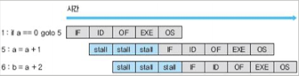
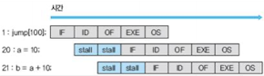
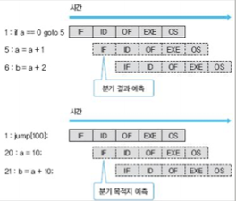
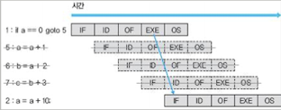
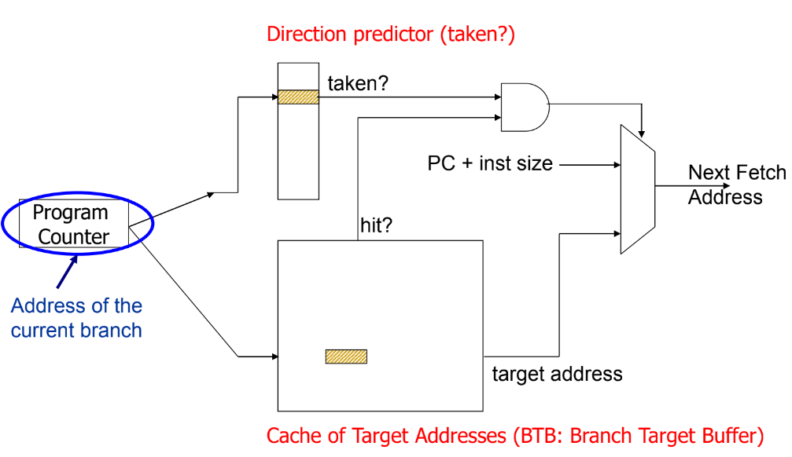
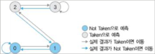

# 13 분기 예측

## 13.1 branch instruction

**branch**(분기문)은 program의 **control flow**(실행 흐름), 다시 말해 PC(Program Counter) 값이 바뀔 수 있는 instruction을 의미한다.(branch가 아니면 PC는 다음 값으로 증가한다.) branch는 다음 두 가지 방법으로 분류할 수 있다. '분기 여부를 따지는 방법' 혹은 '분기 목적지를 얻는 방법'이다.

우선 분기 여부를 따지는 방법에 따라 다음과 같이 나뉘게 된다.

- **conditional branch**(조건 분기문): 특정 condition을 만족할 때 분기한다.

- **unconditional branch**(무조건 분기문): goto, jump로 항상 해당 target(목적지)로 분기한다.

conditional branch를 위해 programming language에서 제공하는 'for, while, do, until' 같은 문법은 사실 machine language에서 제공되지 않는다. compiler가 이러한 high-level language를 풀어주는 것이다. 다음은 간단한 for iteration 구문을 compile했을 때의 결과를 주석으로 단 것이다.

> compiler에 따라 결과는 다를 수 있다.

```c
int sum = 0;
// 00A615F9  mov        dword ptr [sum],0
for (int i = 0; i < 10; ++i)
// 00A61600  mov        dword ptr [i],0       // i = 0;
// 00A61607  jmp        main+22h (0A61612h)   // goto Check;
// 00A61609  mov        eax,dword ptr [i]     // increment:(산술연산)
// 00A6160C  add        eax,1                 // ++i;
// 00A6160F  mov        dword ptr [i],eax     // Check:
// 00A61612  cmp        dword ptr [i], 0Ah    //   if (i == 10)
// 00A61616  jpe        main+33h (0A61623h)   //     goto Exit:
sum += i;                                     // sum += i;
// 00A61618  mov        eax,dword ptr [sum]   // goto Increment;
// 00A6161B  add        eax,dword ptr [i]     // Exit:
// 00A6161B  mov        dword ptr [sum],eax   //
// 00A61621  jmp        main+19h (0A61609h)   //
```

유심히 살펴보면 for문은 두 개의 unconditional branch와 하나의 conditional branch로 구현되는 것을 확인할 수 있다.

이번에는 분기 목적지를 얻는 방법에 따라 나누면 다음과 같다. branch target을 바로 얻을 수 있는지, 혹은 한 번 memory를 참조해야 하는지에 따라 나뉘게 된다.

- **direct branch**(직접 분기문)

- **indirect branch**(간접 분기문)

앞서 본 예제에서 모든 branch는 direct branch이다. 예를 들어 00A61607(jmp  main+22h)에 있는 unconditional branch는 instruction 자체에 바로 branch target이 encoding되어 있다. 즉, instruction decoding(ID) 과정에서 바로 branch target을 알 수 있다.

하지만 indirect branch는 branch target을 알기 위해서 memory reference가 필요하다. 대표적으로 C/C++에서 볼 수 있는 예시는 다음과 같은 예시들이 있다.

- **callback function**(콜백 함수) call

- **proceduce**(프로시저) return

- **virtual function**(가상 함수) call

- **switch**-**case**를 위한 jump table

다음은 callback function 예시다.

```c
typedef int (*COMPARE_CALLBACK)(int, int);
int EqualTestForIntegers(int data1, int data2)
                          { return (data1 == data2); }

void Test(){
    COMPARE_CALLBACK my_callback = &EqualTestForIntegers;
// mov      dword ptr [my_callback],offset
//                     EqualTestForIntegers (1E1A6Eh)
    int result = (*my_callback)(10, 20);
// push     14h
// push     0Ah
// call     dword ptr [my_callback]
// add      esp,8
// mov      dword ptr [result],eax
}
```

- COMPARE_CALLBACK: 'input으로 integer 두 개를 입력받아 int type으로 return하는 function'의 pointer type

- 이 형태에 맞는 EqualTestForIntegers function을 만들어서, Test block 내에서 callback function을 call한다.

- mov dword ptr \[my_callback\],offset EqualtestForIntegers (1E1A6Eh): my_callback variable(function pointer)에 EqualTestForIntegers가 있는 위치를 저장한다.

- push 14h / push 0Ah: function call에 쓰일 두 argument를 stack에 넣는다.

- call dword ptr: callback function call. indirect branch로 구현되어 있다. 정확한 의미는 my_callback variable이 가리키는 곳에 저장된 내용을 읽고 분기하라는 뜻이다.

- add esp,8 / mov dword ptr [result],eax: function call 후 stack 정리와 결과를 result에 저장한다.

---

## 13.2 branch prediction이 필요한 이유



```c
1: if a == 0 goto 5;
5: a = a + 1;
6: b = a + 2;
```

branch는 control dependence를 만들고 pipeline에서 control hazard를 유발했다. 만약 branch가 execution(EXE) 단계에서 분기 여부를 알 수 있다면 processor는 그 때까지 기다릴 수밖에 없어서 stall이 생기게 된다.

- 예를 들어 MIPS processor는 branch 해결을 최대한 앞 단계에서 해결하여, 이러한 pipeline stall 횟수를 줄였다. 

- compiler가 stall이 생긴 자리에 branch의 결과와 상관없는 instruction을 먼저 배치한다. 

  > 이처럼 선행 instruction의 영향 없이 실행되는 instruction slot을 **delay slot**(지연 슬롯)이라고 했다.

indirect branch 역시 control hazard를 유발한다.



```c
1: jump[100];
20: a = 10;
21: b = a + 10;
```

- instruction 1은 indirect branch이다. address 100에 저장된 값으로 PC를 바꾸게 된다.

- address 100에 20이라는 값이 있었고, 따라서 20 instruction으로 가게 된다.

이처럼 memory에 있는 내용을 read하는 작업이 필요하므로 operand fetch(OF) 단계까지 기다리게 된다. 따라서 pipeline stall이 발생한다. 

> 이에 반해 unconditional branch는 계산이 필요하지 않고, direct branch는 memory 참조가 필요 없다. instruction decoding만 거치면 branch target을 알 수 있다.

> 그러나 x86 CISC 구조처럼 복잡한 instruction에서는 이런 작업도 바로 수행되기 어려워서 pipeline stall이 생길 수 있다.

이상적으로 branch가 pipeline 첫 단계에서 그 결과를 알 수 있다면, pipeline stall 없이 pipeline을 작동할 수 있을 것이다. 하지만 그 결과를 계산하는 작업은 일반 연산에 버금가기 때문에, **branch prediction**(분기 예측) 기법을 이용하여 pipeline stall을 최소화한다. branch 결과가 나오지 않았음에도 미리 그 결과를 예측해서 pipeline을 진행시키는 것이다.

이때 정확히는 branch prediction과 branch target prediction 두 종류로 나뉘게 된다.



- branch prediction: 주어진 conditional branch가 taken(분기)하는지, not taken(분기하지 않는지)를 예측한다.(0과 1 두 가지 중 하나를 고른다.)

- branch target prediction: branch가 어디로 분기할지 target을 예측한다. 

  - 다시 말해 0과 1 중 하나를 예측할 수 있는 것이 아니라, 가능한 모든 branch target 중 하나를 골라야 한다.

branch prediction은 processor가 in-order이든 out-of-order이든 상관이 없다. control hazard로 pipeline stall이 발생하는 상황이면 언제나 필요하다.

---

## 13.3 speculative execution

branch predictor(분기 예측기)를 이용하면 **speculative execution**(투기적 실행)이라는 방식의 실행이 가능하다. 이는 예측을 기반으로 더 나은 performance를 가져오는 방향의 instruction 처리를 의미한다. 하지만 이런 특성 때문에 prediction이 빗나가는 경우도 생기게 된다. 다음 예시를 보자.(branch prediction에 기반해 수행된 instruction을 점선으로 표시했다.)

> speculative execution은 memory load에서도 빈번하게 쓰인다.



- processor는 branch prediction 결과를 바탕으로 instruction 5~7을 issue한다.

- 하지만 EXE 단계에서 이 branch 결과는 분기하지 않았음으로 판명된다.

  - 즉, processor instuction은 원래 instruction 2를 가져왔어야 한다.

이렇게 잘못 predict했을 경우, 잘못 처리한 instruction을 모두 무효화시켜야 한다. 이 표현을 pipeline을 **flush**(drain)한다고 표현한다. 그리고 2번 instruction으로 되돌아가서 processor가 다시 시작된다. 

이처럼 speculative execution은 틀릴 수 있으므로 백업이 필수적이다. 다시 말해 undo가 가능하게 준비해야 한다. 그리고 prediction으로 issue된 instruction들은, branch의 결과가 밝혀질 때까지 절대 그 state가 외부로 노출되어서는 안된다. 따라서 computer architectural state인 register나 memory에 최종값을 반영해서는 안 되고 잠시 보류해야 한다.(결과가 확정되고 난 뒤 비로소 유효한 instruction이 되고 외부로 노출될 수 있다.)

따라서 일반적으로 speculative execution에는 다음 장치가 필요하다.

1. 어떤 결과의 미래를 predict하는 장치

2. 결과가 확실하지 않아도 실행을 계속 진행시킬 수 있는 장치

3. prediction이 틀렸을 때 undo할 수 있는 장치

여기서 2번은 OOOE에서 살핀 ROB(re-order buffer)와 같은 장치로 해결할 수 있다. 3번은 processor state에 **checkpoint**를 두어 해결할 수 있다. branch를 만났을 때 필요한 정보를 모아서 checkpoint를 만든 뒤, prediction이 틀리면 이 checkpoint를 load해서 복구한다.

> ROB는 out-of-order processor에서 instruction들을 보관하다가, commit이 가능할 때 실제 memory와 외부에 노출되는 register file(**ARF**, architecture register file)이 갱신됐다.

---

## 13.4 기본적인 branch prediction 방법

앞서 분기된 branch를 **taken branch**, 분기하지 않고 다음 instruction으로 넘어간 branch를 **not-taken branch**라고 했다. 다음 code를 보자.

```c
1: if (i == 10) goto 3:
2: x = x + 1;
3: goto 5:
4: x = x - 1;
```

- branch 1이 condition을 만족해 3번으로 간다면 taken branch이다.

- branch 1이 condition을 만족하지 못하고 그냥 2번으로 간다면 not-taken branch이다.

branch prediction은 크게 **static**(정적)과 **dynamic**(동적) 두 가지 방식으로 나눌 수 있다.

- static branch prediction: 정해진 규칙에 따라서만 움직일 수 있다.(실시간으로 program 내역을 분석하여 능동적으로 대처할 수는 없다.)

    간단한 예로 다음과 같은 정책이 있다.

    1. always taken: 모든 branch가 분기한다.

    2. always not-taken: 모든 branch가 분기하지 않는다.

    3. **BRFNT**(Backward Taken, Forward Not Taken): 뒤로 향하는 branch는 분기, 앞으로 향하는 branch는 분기하지 않는다.

    > 예를 들어 for iteration을 보면 대체로 loop를 마치고 뒤로 돌아가는 것이 탈출하는 것보다 빈번하다.
    
    > 게다가 앞으로 향하는 branch는 보통 쉽게 예측하기 어렵다.

    4. program의 profiling 정보에 따른다.

- dynamic branch prediction: 실제 program의 실행 내역으로 branch을 predict한다.(cache가 locality를 이용하는 것과 흡사하다.)

다음 예시를 보고 branch predictor를 만들어 볼 것이다.

```c
1: for (int i = 0; i < 10000; ++i) {
2:    if ((i % 100) != 0) {
3:        sum += i*i;
4:    } else if ((i % 2) != 0) {
5:        sum += i;
6:    }
7: }
```

> 더 나은 algorithm으로 code를 작성할 수 있지만, 이해를 돕기 위한 예시이다.

- 2, 4번은 conditional branch이다.

- for문의 conditional statement는 i = 10000일 때를 제외하고 계속해서 같은 연산을 한다.

- 2번 역시 i = 100일 때를 제외하면 항상 같은 연산을 수행한다.

다음은 간단한 dynamic branch predictor를 C++ code 형식으로 구현할 것이다. 그런데 branch predictor를 위해 실행 내역을 저장하는 buffer는, cache처럼 size가 제한되므로 특정한 size를 지정해야 한다. 



또한 branch predictor는 크게 세 가지 interface로 구성할 수 있다.

- initialization(초기화)

- prediction(예측)

- update(갱신)

```cpp
class VerySimpleBranchPredictor : public BranchPredictor
{
private:
    bool*  table_;    // True: taken, False: not taken
    size_t size_;     // branch predictor의 size
    
public:
    virtual void Initialize(size_t predictor_entry_size) {
        table_ = new bool[(size_ = predictor_entry_size)];
        // branch의 모든 결과를 not taken으로 설정한다.
        memset(table_, 0, sizeof(predictor_entry_size));
    }
    virtual bool DoPrediction(uint64_t branch_pc) {
        // 주어진 branch의 PC address에 해당하는 값을 읽어서 predict한다.
        return table_[branch_pc % size_];
    }
    virtual void UpdatePredictor(uint64_t branch_pc, bool taken) {
        // branch의 실제 결과를 반영한다.
        table_[branch_pc % size] = taken;
    }
};
```

- branch predictor는 단순히 과거 taken/not-taken 여부만 기록할 것이므로 1bit만 저장한다.(따라서 bool type array로 table_을 만들었다.)

  > 이처럼 마지막 결과를 이용한 branch prediction을 **last time prediction**이라고 지칭한다.

- branch prediction은 그냥 주어진 branch의 PC address에 대응되는 table_의 내용만을 읽어서 수행한다.

  - 예제에서는 단순히 branch의 PC address를 table size로 나눠서 얻어지는 나머지를 index로 사용했다.

  - 이를 수행하는 DoPrediction이 instruction fetch(IF) 단계에서 불리며 speculative execution을 실행한다.

- 만약 branch 결과가 실제로 밝혀지면 branch predictor를 update해야 한다. 이를 **training**이라고 지칭한다.

  - 이렇게 결과를 쓰는 작업은 UpdatePredictor에서 수행한다.

아쉽게도 이런 간단한 방식의 branch prediction은 별로 성능이 좋지 않다. 어쩌다가 한 번씩 발생하는 분기 결과(예를 들어 분기 탈출 등) 값에서 예측이 빗나갈 수 있기 때문이다. 

예를 들어 8번 iteration하는 loop가 있다고 하자. 7번은 taken, 마지막 한 번은 not-taken으로 진행된다. 여기에 VerySimpleBranchPredictor의 성능을 측정하면 다음과 같다.

| iteration | 0 1 2 3 4 5 6 7 | 0 1 2... |
| --- | --- | --- | 
| 실제 분기 결과 | T T T T T T T N | T T T... |
| branch prediction | N T T T T T T T | N T T... |
| 정확도 | X O O O O O O X | X O O... |

8번의 iteration 중 2번 오차가 발생해서 총 error rate는 25%가 된다. 하지만 극단적으로 if ((i % 2) != 0) {sum += i;}와 같은 구문이라면, 매번 iteration 결과가 taken과 not-taken으로 바뀌기 때문에 이전 결과를 쓰면 모든 branch prediction이 빗나가게 된다.

이런 단점을 극복하기 위해서 단순히 taken/not-taken 여부만 기록하지 않고 약간의 저항을 도입할 수 있다. 한 번 정도의 taken/not-taken가 바뀌는 것으로는 branch prediction을 바꾸지 않게 저항을 부여하는 것이다.



따라서 branch table을 단순히 1(taken), 0(not-taken)으로 구성하지 않고, 2bit로 Strongly Not Taken(0), Weakly Not Taken(1), Weakly Taken(2), Strongly Taken(3) 4가지 경우를 도입한다.

- state가 1, 2: 실제 결과에 따라 prediction 값이 바뀐다. 

  - 여기서 branch prediction 결과가 옳다면 0과 3으로 state가 옮겨간다.
  
  - 한 번 결과가 틀려도 branch prediction 값까지는 바꾸지 않게 된다.

마찬가지로 동일한 예시에 2bit counter based branch predictor의 성능을 측정하면 다음과 같다. 총 error rate가 줄어든다.

| iteration | 0 1 2 3 4 5 6 7 | 0 1 2... |
| --- | --- | --- | 
| 실제 분기 결과 | T T T T T T T N | T T T... |
| branch prediction | N T T T T T T T | T T T... |
| 정확도 | X O O O O O O X | O O O... |

다음은 이를 구현한 code이다.

```cpp
class VerySimpleBranchPredictor : public BranchPredictor
{
private:
    bool*  table_;    // 0:StrongNT, 1:WeakNT, 2:WeakT, 3:StrongT
    size_t size_;     // branch predictor의 size
    
public:
    virtual void Initialize(size_t predictor_entry_size) {
        table_ = new bool[(size_ = predictor_entry_size)];
        // branch의 모든 결과를 weakly not taken으로 설정한다.
        memset(table_, 1, sizeof(bool)*size_);
    }
    virtual bool DoPrediction(uint64_t branch_pc) {
        // 주어진 branch의 PC address에 해당하는 값을 읽어서 predict한다.
        return (table_[branch_pc % size_] >= 2);
    }
    virtual void UpdatePredictor(uint64_t branch_pc, bool taken) {
        // branch의 실제 결과를 반영한다.
        table_[branch_pc % size] += (taken ? 1 : -1);
        if (table_[branch_pc % size] > 3) {
            table_[branch_pc % size] = 3;
        }
        if (table_[branch_pc % size] < 0) {
            table_[branch_pc % size] = 0;
        }
    }
};
```

하지만 개선을 적용해도 이런 간단한 algorithm으로는 20%가 넘는 error rate가 생길 수 있다. 이는 (특히 깊은) pipeline processor에서 적은 instruction밖에 fetch하지 못하게 되어 성능을 크게 저하시키게 된다.(ILP를 매우 떨어뜨린다.)

> 이처럼 한 cycle당 최대로 fetch할 수 있는 instruction의 수가 결국 IPC의 상한값이기 때문에, branch prediction의 성능이 높은 IPC를 얻기 위한 기본 조건이다.

---

